# System Overview - Context-Aware Robot Control System

> **Note:** Code blocks in this document are **pseudocode and simplified code snippets** for clarity and readability. For actual implementation, see the referenced source files in `src/`.

---

## System Purpose

This system enables natural language control of an industrial robot by combining:
- **LLM (Large Language Model)** - Understands natural language
- **Knowledge Graph (Neo4j)** - Defines robot capabilities and constraints
- **State Databases (SQLite)** - Tracks current robot state and execution history
- **Deterministic Planning** - Converts intents into safe, executable sequences
- **Safety Validation** - Verifies plans before execution

---

## Key Architecture Principles

1. **Hybrid Architecture**
   - LLM handles natural language understanding
   - Graph algorithms handle deterministic planning
   - Combines probabilistic and deterministic approaches

2. **Context-Aware Validation**
   - Knowledge graph serves as single source of truth
   - Multi-layer safety verification
   - Deterministic constraint checking

3. **Human-in-the-Loop Design**
   - Mandatory operator approval before execution
   - Supports feedback-driven plan revision
   - Provides transparency through plan visualization

4. **Separation of Concerns**
   - LLM Layer: Intent extraction (WHAT)
   - Planning Layer: Path planning (HOW)
   - Knowledge Graph: Constraint definition (POSSIBLE)

---

## System Architecture Diagram

The system architecture consists of four primary layers that process operator commands from natural language input through to robot execution. The Translation Layer handles language understanding and planning, the Verification Layer ensures safety, the Knowledge Layer provides data storage, and the Robot Execution layer interfaces with hardware. Decision points (diamond shapes) route workflow based on validation results, retry counts, and human feedback.

**Note:** This diagram shows the standard workflow. The Router also supports **replay functionality** (UUID-based and phrase-based) that loads pre-existing plans from history and bypasses Intent Parser and Sequence Builder. See [01_ROUTER_AND_INTENT_PARSING.md](01_ROUTER_AND_INTENT_PARSING.md) for replay workflow details.

```mermaid
%%{init: {"flowchart": {"htmlLabels": true}} }%%
flowchart TD
    Operator[/Operator instruction/] --> Router

    subgraph TL["Translation Layer (LangGraph)"]
        Router{"🧠 Router<br/>(Intent Detection)"}
        IntentParser["🧠 Intent Parser<br/>(LLM Goal Extraction)"]
        SequenceBuilder["⚙️ Sequence Builder<br/>(Graph Pathfinding)"]
        Question["🧠 Question Node<br/>(LLM Summary)"]
        PlanningCondition{"◆ Planning Condition<br/>(Check Validation Errors)"}
        Fallback["Fallback Node"]
        HumanReview["🧍 Human Review<br/>(Operator Approval)"]
    end

    subgraph VL["Verification Layer"]
        Verify["⚙️ Verification Layer<br/>(Safety Checks + YAML Generation)"]
        VerifyCondition{"◆ Verify Condition<br/>(Check Safety Results)"}
    end

    subgraph KL["Knowledge Layer"]
        Knowledge[["Knowledge Layer<br/>Graph + State DB + History DB"]]
    end

    subgraph RL["Robot Execution"]
        RobotShim["Robot Layer<br/>(Execute Sequence + Update State)"]
        RobotIO[[Robot Interface]]
    end

    Router -->|action| IntentParser
    Router -->|question| Question
    Router -->|unknown| Fallback

    IntentParser --> SequenceBuilder
    SequenceBuilder --> PlanningCondition

    PlanningCondition -->|valid plan| HumanReview
    PlanningCondition -->|error & attempt < 3| IntentParser
    PlanningCondition -->|error & attempt ≥ 3| Fallback

    HumanReview -->|approved| Verify
    HumanReview -->|revision| IntentParser
    HumanReview -->|declined| Fallback
    HumanReview -->|timeout| Fallback

    Verify --> VerifyCondition

    VerifyCondition -->|pass| RobotShim
    VerifyCondition -->|fail & attempt < 3| IntentParser
    VerifyCondition -->|fail & attempt ≥ 3| Fallback

    IntentParser --- Knowledge
    SequenceBuilder --- Knowledge
    Verify --- Knowledge
    Question --- Knowledge

    RobotShim --> RobotIO
    RobotShim -- Update State + Log Run --> Knowledge
    RobotShim --> QReply[[Natural-Language Reply]]
    Question --> QReply
    Fallback --> QReply

    classDef db fill:#e0f2ff,stroke:#3399ff,stroke-width:1px;
    classDef output fill:#fff2cc,stroke:#b38f00,stroke-width:1px;
    classDef condition fill:#ffe6cc,stroke:#d68000,stroke-width:2px;
    class Knowledge db;
    class RobotShim,RobotIO,QReply output;
    class PlanningCondition,VerifyCondition condition;
```



---

## Complete Flow: Operator Input → Robot Execution

This section demonstrates the complete end-to-end workflow through a concrete example. The flow traces how a natural language command ("weld at position 1 and 2") transforms through seven distinct processing stages, from initial intent classification to physical robot execution. Each step shows the component responsible, its key operations, and the data structure output. This example follows the primary action path where the operator approves the plan and all validations pass successfully.

**Detailed component documentation:**
- Steps 1-2: [ROUTER_AND_INTENT_PARSING.md](01_ROUTER_AND_INTENT_PARSING.md)
- Step 3: [SEQUENCE_PLANNING.md](02_SEQUENCE_PLANNING.md)
- Step 4: [HUMAN_REVIEW.md](03_HUMAN_REVIEW.md)
- Steps 5-6: [VERIFICATION.md](04_VERIFICATION.md)
- Step 7: [EXECUTION.md](05_EXECUTION.md)

```
┌────────────────────────────────────────────────────────────────┐
│  OPERATOR INPUT: "weld at position 1 and 2"                    │
└────────────────────────────────────────────────────────────────┘
                            ↓
┌────────────────────────────────────────────────────────────────┐
│  STEP 1: ROUTER                                                │
│  • Generates correlation ID (tracking)                         │
│  • Classifies intent type: action / question / unknown         │
│  • Uses LLM to understand input category                       │
│  Output: "action" (requires robot execution)                   │
└────────────────────────────────────────────────────────────────┘
                            ↓
┌────────────────────────────────────────────────────────────────┐
│  STEP 2: INTENT PARSER                                         │
│  • Extracts high-level intent from natural language            │
│  • LLM identifies WHAT user wants (not HOW)                    │
│  • Queries Neo4j for context (positions, tools, routines)      │
│  Output: {"goal": "sequence", "steps": [                       │
│    {"action": "execute_routine", "routine": "tack_weld",       │
│     "position": "Pos_1"},                                      │
│    {"action": "execute_routine", "routine": "tack_weld",       │
│     "position": "Pos_2"}                                       │
│  ]}                                                            │
└────────────────────────────────────────────────────────────────┘
                            ↓
┌────────────────────────────────────────────────────────────────┐
│  STEP 3: SEQUENCE BUILDER                                      │
│  • Converts intent into concrete executable steps              │
│  • Uses Neo4j pathfinding for navigation                       │
│  • Adds tool changes automatically                             │
│  • Deterministic (no LLM - just graph algorithms)              │
│  Output: [                                                     │
│    {id: 1, action: "move", target: "Safe_Pos_1"},              │
│    {id: 2, action: "move", target: "Tool_Welder_Position"},    │
│    {id: 3, action: "routine", target: "tool_attach", ...},     │
│    {id: 4, action: "move", target: "Safe_Pos_1"},              │
│    {id: 5, action: "move", target: "Pos_1"},                   │
│    {id: 6, action: "routine", target: "tack_weld", ...},       │
│    ... (continues for Pos_2)                                   │
│  ]                                                             │
└────────────────────────────────────────────────────────────────┘
                            ↓
┌────────────────────────────────────────────────────────────────┐
│  STEP 4: HUMAN REVIEW                                          │
│  • Displays plan as numbered list                              │
│  • Operator chooses: [a]pprove / [r]evise / [d]ecline          │
│  • 240 second timeout                                          │
│  Output: "approved"                                            │
└────────────────────────────────────────────────────────────────┘
                            ↓
┌────────────────────────────────────────────────────────────────┐
│  STEP 5: VERIFIER                                              │
│  • Validates plan against graph constraints                    │
│  • Checks: positions exist, edges exist, routines supported    │
│  • Simulates robot state (position, tool)                      │
│  • Catches tool conflicts, illegal moves                       │
│  Output: {valid: true}                                         │
└────────────────────────────────────────────────────────────────┘
                            ↓
┌────────────────────────────────────────────────────────────────┐
│  STEP 6: YAML CONVERTER                                        │
│  • Converts validated JSON plan to YAML format                 │
│  • Simple format transformation (no business logic)            │
│  • Robot controller readable format                            │
│  Output: YAML string ready for robot                           │
└────────────────────────────────────────────────────────────────┘
                            ↓
┌────────────────────────────────────────────────────────────────┐
│  STEP 7: ROBOT EXECUTOR                                        │
│  • Executes plan step-by-step                                  │
│  • Sends commands to robot controller                          │
│  • Updates robot state in SQLite                               │
│  • Logs execution history                                      │
│  Output: Task completed successfully                           │
└────────────────────────────────────────────────────────────────┘
                            ↓
┌────────────────────────────────────────────────────────────────┐
│  OPERATOR SEES: "Task completed successfully."                 │
└────────────────────────────────────────────────────────────────┘
```

---

## Data Flow Through System

This section shows the actual data structures exchanged between components during the workflow described above. Each step includes example JSON/YAML outputs demonstrating the data transformation from natural language input to robot execution. This technical reference is useful for understanding implementation details and debugging data format issues.

### Input Data
```python
operator_input = "weld at position 1 and 2"
```

### Step 1: Router Output
```python
{
    "correlation_id": "abc-123-def",
    "intent_type": "action"
}
```

### Step 2: Intent Parser Output
```python
{
    "intent": {
        "goal": "sequence",
        "steps": [
            {"action": "execute_routine", "routine": "tack_weld", "position": "Pos_1"},
            {"action": "execute_routine", "routine": "tack_weld", "position": "Pos_2"}
        ]
    }
}
```

### Step 3: Sequence Builder Output
```python
{
    "plan": [
        {"id": 1, "action": "move", "target": "Safe_Pos_1"},
        {"id": 2, "action": "move", "target": "Tool_Welder_Position"},
        {"id": 3, "action": "routine", "target": "tool_attach", "position": "Tool_Welder_Position", "tool": "Welder"},
        {"id": 4, "action": "move", "target": "Safe_Pos_1"},
        {"id": 5, "action": "move", "target": "Pos_1"},
        {"id": 6, "action": "routine", "target": "tack_weld", "position": "Pos_1", "stabilize": 1.5},
        {"id": 7, "action": "move", "target": "Safe_Pos_1"},
        {"id": 8, "action": "move", "target": "Pos_2"},
        {"id": 9, "action": "routine", "target": "tack_weld", "position": "Pos_2", "stabilize": 1.5},
        {"id": 10, "action": "move", "target": "Safe_Pos_1"},
        {"id": 11, "action": "move", "target": "Tool_Welder_Position"},
        {"id": 12, "action": "routine", "target": "tool_release", "position": "Tool_Welder_Position", "tool": "Welder"},
        {"id": 13, "action": "move", "target": "Safe_Pos_1"},
        {"id": 14, "action": "move", "target": "Home"}
    ]
}
```

### Step 4: Human Review Output
```python
{
    "human_decision": "approved",
    "human_comments": None
}
```

### Step 5: Verifier Output
```python
{
    "verification_result": {
        "valid": True,
        "missing_positions": [],
        "illegal_edges": [],
        "unsupported_routines": [],
        "tool_conflicts": [],
        "feedback": ""
    }
}
```

### Step 6: YAML Converter Output
```yaml
RobotSequence:
  name: weld_at_position_1_and_2_abc123
  description: Robot task sequence
  correlation_id: abc-123-def
  steps:
    - id: 1
      name: Move to Safe_Pos_1
      action: move
      target: Safe_Pos_1
    - id: 2
      name: Move to Tool_Welder_Position
      action: move
      target: Tool_Welder_Position
    # ... (all steps)
```

### Step 7: Robot Executor Output
```python
{
    "success": True,
    "message": "Simulated successfully (14 steps)",
    "run_id": "abc-123-def"
}
```

---

## Knowledge Sources

**For detailed schema definitions, query patterns, and usage examples, see [06_KNOWLEDGE_LAYER.md](06_KNOWLEDGE_LAYER.md)**

### Neo4j Graph Database
**Contains:** Robot capabilities and constraints

**Nodes:**
- `Position` - Locations (Home, Safe_Pos_1, Pos_1, etc.)
- `Tool` - Available tools (Camera, Welder)
- `ToolStand` - Tool storage locations
- `Routine` - Actions (tack_weld, camera_inspection, tool_attach, tool_release)

**Relationships:**
- `:ONLY_ALLOWED_MOVE_TO` - Valid motion paths (Position ↔ Position)
- `:SUPPORTED_AT` - Routine availability with metadata (Routine → Position)
- `:LOCATED_AT` - Tool stand locations (ToolStand → Position)
- `:TOOL_AVAILABLE_AT` - Tool storage (Tool → ToolStand)

**Purpose:**
- Single source of truth for robot capabilities
- Defines what's possible (positions, moves, routines)
- Provides metadata (stabilize times, verification routines)

---

### SQLite Databases

#### robot_state.db
**Contains:** Current robot state

**Table:** `robot_state`
- `current_position` - Where robot is now
- `current_tool` - What robot is holding
- `last_updated` - Timestamp

**Purpose:** Track robot state across commands

#### history.db
**Contains:** Execution history

**Tables:**
- `runs` - Each task execution
- `run_steps` - Individual steps per run

**Purpose:** Audit trail, replay capabilities

---

## Error Handling & Retry Logic

**For detailed error handling workflows, retry mechanisms, and fallback scenarios, see [07_ERROR_HANDLING.md](07_ERROR_HANDLING.md)**

The system handles failures gracefully through retry mechanisms and fallback handling. Four distinct scenarios are supported:

### 1. Planning Failures (Sequence Builder Errors)

When the Sequence Builder cannot create a valid plan (e.g., no path exists, tool not available):


**Max retries:** 3 attempts  
**On failure:** Fallback handler provides explanation (e.g., "Cannot reach Pos_5 from Home - no valid path exists")

---

### 2. Verification Failures (Safety Validation Errors)

When the Verifier detects safety issues (e.g., illegal edge, unsupported routine, tool conflict):


**Max retries:** 3 attempts  
**On failure:** Fallback handler provides safety explanation (e.g., "Cannot execute tack_weld at Pos_5 - routine not supported at this position")

---

### 3. Human Review Decisions

Operator has four possible responses during the approval gate:


**Decisions:**
- **Approved** → Plan proceeds to verification
- **Revise** → Sequence Builder regenerates plan with operator feedback (no retry limit)
- **Declined** → Task cancelled, operator sees confirmation message
- **Timeout** → Task cancelled after 240 seconds of inactivity

---

### 4. Unknown Intents (Router Failures)

When Router cannot classify operator input:


**No retries** - User must rephrase command  
**Example response:** "I didn't understand your request. Please try asking to 'move to position X' or 'execute routine Y at position Z'"

---

## Documentation Structure

**Component documentation files**:

**[01 Router and Intent Parsing](01_ROUTER_AND_INTENT_PARSING.md)** - Intent classification and goal extraction
**[02 Sequence Planning](02_SEQUENCE_PLANNING.md)** - Deterministic step planning with graph algorithms
**[03 Human Review](03_HUMAN_REVIEW.md)** - Operator approval gate
**[04 Verification](04_VERIFICATION.md)** - Safety validation and YAML conversion
**[05 Execution](05_EXECUTION.md)** - Robot control and state updates
**[06 Knowledge Layer](06_KNOWLEDGE_LAYER.md)** - Neo4j and SQLite database schemas

