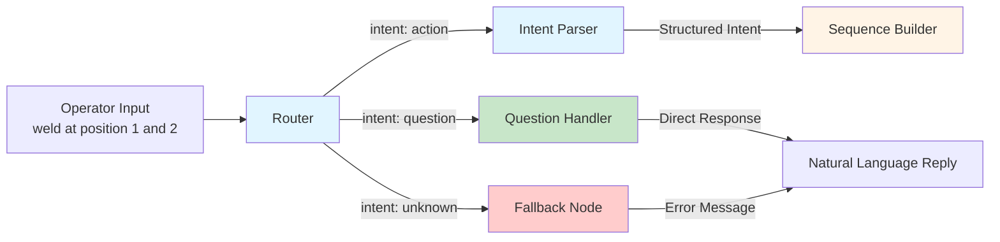
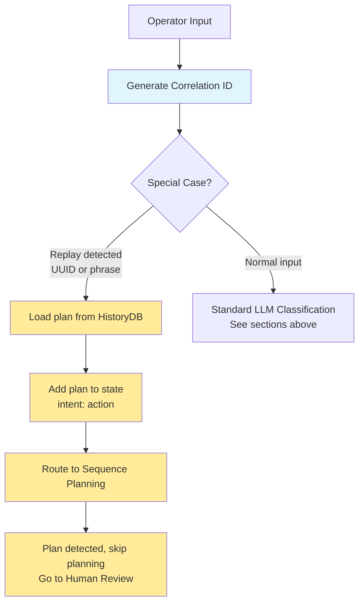

# Router and Intent Parsing - Natural Language Processing Layer

> **Note:** Code blocks in this document are **pseudocode and simplified code snippets** for clarity and readability. For actual implementation, see the referenced source files in `src/`.

---

## Overview

The Router and Intent Parser form the **Natural Language Processing layer** that converts operator commands into structured data.

### Workflow Structure

**Router** (universal entry point) classifies ALL operator input into three branches:
1. **action** → Intent Parser extracts structured goals → Sequence Builder
2. **question** → Question Handler provides information (no Intent Parser)
3. **unknown** → Fallback Handler provides error message (no Intent Parser)

**This document covers:** Router (Part 1) and Intent Parser (Part 2), shown in blue below.



**Key Point:** Intent Parser is ONLY used for the "action" branch. Question and Fallback handlers process their intents directly without parsing.

---

## Part 1: Router - Intent Classification

**Purpose:** Entry point that classifies operator input and generates correlation ID

### Responsibilities

1. Generate unique correlation ID (UUID) for request tracking
2. Classify input into three categories: action, question, unknown
3. Handle special cases (task replay by UUID, repeat last task)
4. Route to appropriate workflow node

### Input

```python
{
    "operator_input": "weld at position 1 and 2"
}
```

### Output

```python
{
    "correlation_id": "be892f3d-9cfc-44de-acff-c82576a46603",
    "operator_input": "weld at position 1 and 2",
    "intent": "action",
    "plan_attempt": 1
}
```

---

### Intent Categories

#### 1. action - Robot Execution Required

**Definition:** Operator requests robot to perform physical task (movement, routine, tool change)

**Examples:**
- "Move to position 1"
- "Weld at position 2"
- "Attach the camera"
- "Can you inspect at area 3?" (polite request)
- "Please go to home"
- "Do that again" (replay last task)
- "proceed" (confirmation after plan review)

**Characteristics:**
- Requires task planning and execution
- May involve movement, tools, routines
- Results in state change (position, tool, history)

**Routing:** → Intent Parser → Sequence Builder → Human Review → Verifier → Robot Executor

---

#### 2. question - Information Query

**Definition:** Operator requests information about system state or capabilities

**Examples:**
- "What positions are available?"
- "Where is the robot?"
- "Show me the tools"
- "What did you do?"
- "Give me the last 15 tasks"
- "Tell me more" (follow-up question)

**Characteristics:**
- No robot movement or state change
- Queries Neo4j or SQLite databases
- Returns formatted text response

**Routing:** → Question Handler (returns information)

---

#### 3. unknown - Unclear or Out-of-Scope

**Definition:** System cannot determine intent or input is not related to robot control

**Examples:**
- "Hello" (greeting, not command)
- "What's the weather?" (out of scope)
- "asdfgh" (gibberish)
- "" (empty input)

**Characteristics:**
- Ambiguous or unclear phrasing
- Not related to robot capabilities
- Cannot be processed

**Routing:** → Fallback (error message with suggestions)

---

### Classification Implementation

#### Step 1: Build System Context

```python
def _build_system_capabilities() -> str:
    routines = neo4j.get_all_routines()
    tools = neo4j.get_all_tools()
    positions = neo4j.get_all_positions()
    
    return f"""
    Available routines: {[r["name"] for r in routines]}
    Available tools: {[t["name"] for t in tools]}
    Available positions: {[p["name"] for p in positions]}
    """
```

**Purpose:** LLM needs system capabilities to classify correctly

**Example:**
- Input: "Scan at area 5"
- Context: LLM sees "camera_inspection" routine exists
- Classification: "action" (valid routine request)

---

#### Step 2: LLM Prompt Structure

The system capabilities from Step 1 are inserted into the classification prompt, this prompt contains about 440 tokens. 

```
You are an intent classifier for a context-aware robot control system.

SYSTEM CAPABILITIES:
{capabilities}

Your task: Classify the operator's input into ONE of these intents:

1. "action" - Commands that require robot movement, tool operations, or routine execution
   Examples: 
   - Direct commands: "Move to station 5", "Process at area B", "Pick up the gripper tool"
   - Polite requests: "Can you scan checkpoint 3?", "Please weld at position 2"
   - Repeat commands: "Do that again", "Repeat the last task", "Can you do the first task again?"
   - Confirmations: "proceed", "yes", "go ahead", "do it" (after a plan review)
   
2. "question" - Queries about system state, capabilities, or history (NO ACTION REQUESTED)
   Examples: 
   - Information: "What stations are available?", "Where is the robot?", "Show me the tools"
   - History: "What did you do?", "Show me the history", "Give me the task list"
   - Follow-ups: "Tell me more", "What about tools?", "And the routines?"
   - Implicit context: "give me the 15 latest", "show me 10 more", "what about the rest?"
   
3. "unknown" - ONLY for completely unclear or out-of-scope requests
   Examples: "Hello", "What's the weather?", "asdfgh"

**CRITICAL DISTINCTION:**
- "Can you do X?" or "Do X again" = ACTION (operator wants execution)
- "What is X?" or "Show me X" = QUESTION (operator wants information)
- "proceed" / "yes" / "go ahead" = ACTION (confirmation after review)

OPERATOR INPUT: "{operator_input}"

Respond with ONLY a JSON object in this exact format:
{
  "intent": "action|question|unknown",
  "reasoning": "Brief explanation"
}

Do NOT include any other text, commentary, or markdown formatting.
```

**Example of capabilities context:**
```
SYSTEM CAPABILITIES:
Available routines: tack_weld, camera_inspection
Available tools: Camera, Welder
Available positions: Home, Safe_Pos_1, Pos_1, Pos_2, Pos_3
```

**Purpose:** Context allows LLM to make informed decisions about what the operator is requesting

---

#### Step 3: Parse LLM Response

```python
classification = json.loads(llm_response)
intent = classification.get("intent")

# Validation
if intent not in ["action", "question", "unknown"]:
    logger.warning("Invalid intent from LLM, defaulting to unknown")
    intent = "unknown"
```

---

### Special Case Handling: Task Replay

**Purpose:** Enable exact replay of previous tasks without re-parsing or re-planning

The Router checks for replay requests BEFORE performing normal LLM classification. Two replay modes are supported:

#### Processing Flow



**Replay Flow Details:**

1. **Router detects replay** - UUID pattern (`run task abc-123`) or phrase (`do that again`)
2. **Load from history** - Query HistoryDB for specific task (UUID) or latest completed task (phrase)
3. **Add plan to state** - Pre-existing plan loaded, sets `intent: "action"`, **NEW correlation ID generated**
4. **Bypass planning** - Sequence Planning detects existing plan in state
5. **Human Review** - Plan still requires approval before execution

---

#### Replay by UUID

**Input:** "run task abc-123-def-456"

**Processing:**
1. Detect UUID pattern in input (regex match)
2. Query HistoryDB for task with matching `run_id`
3. Load `sequence_json` (the validated plan) from historical record
4. Add `"plan": plan` to state (bypasses Intent Parser and Sequence Builder)
5. Flow continues to Human Review with pre-existing plan

**Purpose:** Exact replay of previous task - no re-parsing or re-planning needed

**Note:** Each replay execution gets a NEW correlation ID for independent tracking

---

#### Repeat Last Task (General Replay)

**Input:** "do that again", "repeat the last one", "run the same"

**Processing:**
1. Detect replay phrases in input
2. Query HistoryDB for most recent completed task
3. Load `sequence_json` from last successful run
4. Add `"plan": plan` to state (bypasses Intent Parser and Sequence Builder)
5. Flow continues to Human Review with pre-existing plan

**Purpose:** Convenience feature for repetitive tasks - reuses exact same plan

**Note:** Each replay execution gets a NEW correlation ID for independent tracking

---

## Part 2: Intent Parser - High-Level Goal Extraction
  
**Purpose:** Convert natural language into high-level goals (WHAT operator wants, not HOW to achieve it)

**Note:** Intent Parser is a function called FROM INSIDE the Sequence Planning node, not a separate workflow node. Router routes to "sequence_planning", which then calls `parse_intent_node()` internally.

### Responsibilities

1. Query Neo4j for system capabilities (positions, tools, routines)
2. Query SQLite for current robot state
3. Build LLM prompt with context
4. Parse natural language into high-level goals (WHAT operator wants, NOT HOW to achieve it)
5. Handle revision feedback from Human Review
6. Handle validation errors from planning failures

### Input

**User requests:** "weld at position 1 and 2"

**Intent Parser receives:**

```python
{
    "correlation_id": "be892f3d-9cfc-44de-acff-c82576a46603",
    "operator_input": "weld at position 1 and 2",
    "human_comments": None,  # From revision feedback
    "validation_errors": None  # From planning errors detected by verification layer
}
```

**Note:** The `intent` field from Router (action/question/unknown) is used for routing but is NOT passed to Intent Parser. Intent Parser receives the raw operator input and human comments if its a human review task or validation errors if the validator throws back requests to the planner.

### Output

Intent Parser produces **high-level goals** without navigation paths, tool change logic, or step IDs.

**Example:**

```python
{
    "intent": {
        "goal": "sequence",
        "steps": [
            {"action": "routine", "routine": "tack_weld", "position": "Pos_1"},
            {"action": "routine", "routine": "tack_weld", "position": "Pos_2"}
        ]
    }
}
```

This example represents 2 high-level goals. The Sequence Builder (documented in `02_SEQUENCE_PLANNING.md`) will expand these into a detailed execution plan with navigation paths, tool changes, and sequential step IDs


---

### Intent Goal Types

#### 1. Simple Movement

**Format:**
```json
{
    "goal": "move",
    "position": "<position_name>"
}
```

**Examples:**
- "go to position 1" → `{"goal": "move", "position": "Pos_1"}`
- "move to home" → `{"goal": "move", "position": "Home"}`
- "navigate to safe position 2" → `{"goal": "move", "position": "Safe_Pos_2"}`

---

#### 2. Execute Routine

**Format:**
```json
{
    "goal": "execute_routine",
    "routine": "<routine_name>",
    "position": "<position_name>"
}
```

**Examples:**
- "weld at position 2" → `{"goal": "execute_routine", "routine": "tack_weld", "position": "Pos_2"}`
- "inspect at position 1" → `{"goal": "execute_routine", "routine": "camera_inspection", "position": "Pos_1"}`

---

#### 3. Attach Tool

**Format:**
```json
{
    "goal": "attach_tool",
    "tool": "<tool_name>"
}
```

**Examples:**
- "grab the camera" → `{"goal": "attach_tool", "tool": "Camera"}`
- "attach welder" → `{"goal": "attach_tool", "tool": "Welder"}`

---

#### 4. Release Tool

**Format:**
```json
{
    "goal": "release_tool"
}
```

**Examples:**
- "return the tool"
- "put back camera"
- "release welder"

---

#### 5. Release Tool and Return Home

**Format:**
```json
{
    "goal": "release_tool_and_home"
}
```

**Examples:**
- "return tool and go home"
- "put back camera and return to home position"
- "finish up" (context-dependent)

---

#### 6. Multi-Step Sequence

**Format:**
```json
{
    "goal": "sequence",
    "steps": [
        {"action": "routine", "routine": "<routine_name>", "position": "<position_name>"},
        {"action": "routine", "routine": "<routine_name>", "position": "<position_name>"},
        {"action": "move", "position": "<position_name>"}
    ]
}
```

**Examples:**
- "weld at position 1, 2, and 3" →
  ```json
  {
      "goal": "sequence",
      "steps": [
          {"action": "routine", "routine": "tack_weld", "position": "Pos_1"},
          {"action": "routine", "routine": "tack_weld", "position": "Pos_2"},
          {"action": "routine", "routine": "tack_weld", "position": "Pos_3"}
      ]
  }
  ```

- "inspect all positions" →
  ```json
  {
      "goal": "sequence",
      "steps": [
          {"action": "routine", "routine": "camera_inspection", "position": "Pos_1"},
          {"action": "routine", "routine": "camera_inspection", "position": "Pos_2"},
          {"action": "routine", "routine": "camera_inspection", "position": "Pos_3"}
      ]
  }
  ```

**Note:** "all positions" expands to ALL work positions (role="work") from Neo4j context.

---

### Context Building

#### Neo4j Queries

```python
positions = neo4j.get_all_positions()
# [{"name": "Home", "role": "home"}, {"name": "Pos_1", "role": "work"}, ...]

tools = neo4j.get_all_tools()
# [{"name": "Camera", "description": "..."}, {"name": "Welder", "description": "..."}]

routines = neo4j.get_all_routines()
# [{"name": "tack_weld", "required_tool": "Welder"}, ...]
```

#### SQLite Queries

```python
robot_state = state_db.get_state()
# {"current_position": "Home", "current_tool": "none"}

recent_runs = history_db.get_runs_by_date(today)
# [{"run_id": "...", "operator_input": "...", "status": "completed"}, ...]
```

#### Context Assembly

```python
context = {
    "robot_position": robot_state["current_position"],
    "robot_tool": robot_state["current_tool"],
    "positions": positions,
    "tools": tools,
    "routines": routines,
    "last_run": last_completed_run  # For "repeat" commands
}
```

---

### LLM Prompt Structure
This prompt is about 2300 tokens without the dynamic added variables. 

```
You are an intent parser for a robot system. Convert the operator's command into a structured intent.

**Current Robot State:**
- Position: {context['robot_position']}
- Tool: {context['robot_tool']}

**Available Positions:**
{json.dumps(context['positions'], indent=2)}

**Available Tools:**
{json.dumps(context['tools'], indent=2)}

**Available Routines:**
{json.dumps(context['routines'], indent=2)}"""

    # Add last run context if available
    if context.get('last_run'):
        prompt += f"""

**Last Completed Task:**
Command: "{context['last_run']['command']}"
Run ID: {context['last_run']['run_id']}

NOTE: If the operator says "again", "repeat", "do it again", "run the latest task again", etc., 
you should parse it as the SAME intent as the last completed task above."""

    prompt += f"""

**Operator Command:** {operator_input}

**IMPORTANT - How to handle "full" or "all" keywords:**
When the operator says "full" or "all" (e.g., "do a full scan", "process all stations"), you MUST create steps for EVERY work position listed above.
For example, if Available Positions shows Station_A, Station_B, and Station_C, then "full scan" means:
- Scan at Station_A
- Scan at Station_B  
- Scan at Station_C

Do NOT pick just one position when "full" or "all" is specified.
"""
    
    # Add human feedback if this is a revision
    if human_comments:
        prompt += f"""

**CRITICAL - Human Revision Request:**
The operator reviewed your previous plan and wants changes.

Original command: "{operator_input}"
Human feedback: "{human_comments}"

Your task: Re-parse the ORIGINAL command ("{operator_input}") but APPLY the human's feedback.

Examples:
- Original: "visit all positions" + Feedback: "dont attach tools" → Parse as simple movement to all positions (NO tool operations)
- Original: "go to pos 1" + Feedback: "also go to pos 2" → Parse as sequence visiting both positions
- Original: "inspect pos 3" + Feedback: "use the camera" → Parse as camera inspection at pos 3

IMPORTANT: The feedback MODIFIES the original command. You must understand what the original command meant, then adjust it based on feedback.
"""
    
    if validation_errors:
        prompt += f"""

**IMPORTANT - Previous Planning Error:**
The last attempt to build a plan failed with this error:
"{validation_errors}"

Please adjust your intent parsing to avoid this error. Consider:
- Are you using correct position/tool/routine names from the lists above?
- Are you following the format rules correctly?
- Does the requested action make sense given the available resources?
"""
    
    prompt += """

**Your Task:** Parse the command into ONE of these intent types.

**═══════════════════════════════════════════════════════════════════════════**
**MOST CRITICAL RULE - READ THIS FIRST:**
**═══════════════════════════════════════════════════════════════════════════**

DO NOT ADD TOOL OPERATIONS UNLESS THE OPERATOR EXPLICITLY SAYS SO.

The system AUTOMATICALLY handles tool picking, dropping, and changing.
YOU ONLY parse what the operator EXPLICITLY requested.

Commands like these are MOVEMENT ONLY (NO tools):
- "visit all positions" → ONLY movement, NO tool_attach
- "go to position 1" → ONLY movement, NO tool_attach  
- "move to position 2" → ONLY movement, NO tool_attach
- "tour the work area" → ONLY movement, NO tool_attach

Tool operations are ONLY when explicitly mentioned:
- "grab the welder" → YES, tool attach
- "pick up camera" → YES, tool attach
- "return the tool" → YES, tool release

**═══════════════════════════════════════════════════════════════════════════**

WRONG EXAMPLES (DO NOT DO THIS):
User: "visit all positions"
WRONG: {{"goal": "sequence", "steps": [
  {{"action": "move", "position": "<position_1>"}},
  {{"action": "routine", "routine": "tool_attach", "position": "<position_1>"}},  ← WRONG! Not requested!
  ...
]}}
CORRECT: {{"goal": "sequence", "steps": [
  {{"action": "move", "position": "<position_1>"}},
  {{"action": "move", "position": "<position_2>"}},
  {{"action": "move", "position": "<position_3>"}}
]}}

User: "go to position 1"
WRONG: Including tool_attach
CORRECT: {{"goal": "move", "position": "<position_1>"}}

User: "move to position 1 and back home"
WRONG: Including tool operations
CORRECT: {{"goal": "sequence", "steps": [
  {{"action": "move", "position": "<position_1>"}}, 
  {{"action": "move", "position": "<home_position>"}}
]}}

**═══════════════════════════════════════════════════════════════════════════**

**CRITICAL PARSING PRECEDENCE** (check in this order):

1. **POSITION EXPLICITLY SPECIFIED** → Limit to that position ONLY
   - Keywords: "pos", "position", "at", followed by identifier
   - "routine at station 5" → ONLY station 5, even if other stations exist
   - "weld and inspect pos 1" → ONLY pos 1 for BOTH actions
   - "scan area 3" → ONLY area 3
   
2. **MULTIPLE POSITIONS LISTED** → Limit to listed positions ONLY  
   - "routine at station 1 and 2" → ONLY those two stations
   - "inspect areas 1, 2, and 3" → ONLY those three areas
   
3. **"FULL" or "ALL" KEYWORD** → Apply to EVERY SINGLE work position available
   - **THIS IS THE MOST COMMON MISTAKE**: When you see "full" or "all", you MUST create a step for EACH work position
   - "do a full inspection" → Create one step for EVERY work position listed in Available Positions
   - "scan all areas" → Create one step for EVERY work position 
   - "process all stations" → Create a step for Station_A, Station_B, Station_C, etc. (ALL of them)
   - **CRITICAL**: Do NOT pick just one position when "full" is specified - include ALL work positions
   
4. **NO POSITION AND NO "FULL"** → Use "unknown" goal (need clarification)

**EXAMPLE - "FULL" KEYWORD WITH MULTIPLE POSITIONS:**
Available Positions: [{{"name": "Station_A", "role": "work"}}, {{"name": "Station_B", "role": "work"}}, {{"name": "Station_C", "role": "work"}}]
User: "do a full scan"

CORRECT output (includes ALL stations):
{{
  "goal": "sequence", 
  "steps": [
    {{"action": "routine", "routine": "scanner_routine", "position": "Station_A"}},
    {{"action": "routine", "routine": "scanner_routine", "position": "Station_B"}},
    {{"action": "routine", "routine": "scanner_routine", "position": "Station_C"}}
  ]
}}

WRONG output (only includes one station):
{{"goal": "routine", "routine": "scanner_routine", "position": "Station_B"}}  ← Missing Station_A and Station_C!

**Intent Type Formats:**

1. **Simple Movement**
   Format: {{"goal": "move", "position": "<position_name>"}}
   Generic Examples: "go to station 5", "move to home", "navigate to checkpoint A"

2. **Execute Routine**
   Format: {{"goal": "execute_routine", "routine": "<routine_name>", "position": "<position_name>"}}
   Generic Examples: "scan at station 2", "process at area B", "measure at checkpoint 3"

3. **Attach Tool**
   Format: {{"goal": "attach_tool", "tool": "<tool_name>"}}
   Generic Examples: "grab the scanner", "pick up gripper", "attach drill"

4. **Release Tool**
   Format: {{"goal": "release_tool"}}
   Generic Examples: "return the tool", "put back scanner", "release gripper"

5. **Release Tool and Return Home**
   Format: {{"goal": "release_tool_and_home"}}
   Generic Examples: "return tool and go home", "put back drill and go to home position"

6. **Multi-Step Sequence**
   Format: {{"goal": "sequence", "steps": [
       {{"action": "routine", "routine": "<routine_name>", "position": "<position_name>"}},
       {{"action": "routine", "routine": "<routine_name>", "position": "<position_name>"}},
       {{"action": "release_tool_and_home"}}
   ]}}
   
   Generic Examples (demonstrating precedence):
   - "scan station 2 then drill it" → ONLY station 2 (position specified)
   - "process areas 1 and 3" → ONLY areas 1 and 3 (multiple listed)
   - "do a full scan" → ALL work positions (full keyword)
   - "scan and drill station 5" → ONLY station 5 for BOTH actions (position specified)

**CRITICAL RULES:**
- Use EXACT names from available positions/tools/routines lists above
- **NEVER EVER include tool attach/release/change steps UNLESS explicitly requested by the operator**
- **The system automatically handles tool operations - you only parse what the operator asked for**
- **ONLY include the actual work routines or movements that the operator explicitly requested**
- Examples of what to NEVER include (unless operator says so): tool_attach, tool_release, pick_tool, drop_tool, tool changes, navigation to tool stands
- **Simple movement commands = ONLY movement, NO TOOL OPERATIONS**
- For compound commands ("and then", "after that") → use "sequence" goal
- Return ONLY valid JSON, no explanatory text
- If command is ambiguous or unclear, use {{"goal": "unknown"}}
- **REMEMBER**: "full" or "all" means you must create a step for EVERY work position - not just one

**Example - What to include vs exclude:**
User: "do a full inspection"
CORRECT: {{"goal": "sequence", "steps": [
  {{"action": "routine", "routine": "<routine_name>", "position": "<position_1>"}},
  {{"action": "routine", "routine": "<routine_name>", "position": "<position_2>"}},
  {{"action": "routine", "routine": "<routine_name>", "position": "<position_3>"}}
]}}
WRONG: Including any tool_attach, tool_release, or moves to tool stands

User: "go to position 1 and back home"
CORRECT: {{"goal": "sequence", "steps": [
  {{"action": "move", "position": "<position_1>"}},
  {{"action": "move", "position": "<home_position>"}}
]}}
WRONG: Including tool_attach, tool_release, or any routine steps (operator only asked for movement!)

**Return JSON only:**
```

---

### Response Parsing

The Intent Parser must handle various LLM response formats since LLMs sometimes include extra text or markdown formatting despite being instructed to return only JSON.

**Parsing Strategy:**

1. **Markdown Removal** - If response starts with ` ``` `, remove code block markers
2. **JSON Extraction** - Locate first `{` and last `}` to extract JSON object
3. **Validation** - Parse JSON and validate structure
4. **Fallback** - If parsing fails, default to `{"goal": "unknown"}`

**Example LLM Responses Handled:**

```
Format 1 (Plain JSON):
{"goal": "move", "position": "Pos_1"}

Format 2 (Markdown):
```json
{"goal": "move", "position": "Pos_1"}
```

Format 3 (With commentary):
Here's the parsed intent:
{"goal": "move", "position": "Pos_1"}
```

**Result:** All formats successfully extract the JSON object `{"goal": "move", "position": "Pos_1"}`

**Error Handling:** If JSON parsing fails (malformed JSON, missing braces, etc.), the system defaults to `{"goal": "unknown"}` and logs the error for debugging.

---

### Revision Handling

**Scenario:** Human Review rejects plan with feedback

**Flow:**
1. Human Review returns `{"human_decision": "revision", "human_comments": "Skip position 2, too risky"}`
2. Intent Parser receives `human_comments` in state
3. LLM prompt includes feedback: "Human Revision Feedback: Skip position 2, too risky"
4. LLM adjusts intent based on feedback
5. New intent flows to Sequence Builder for re-planning

**Example:**

**Original:**
- Input: "weld at positions 1, 2, and 3"
- Intent: `{"goal": "sequence", "steps": [Pos_1, Pos_2, Pos_3]}`
- Human Review: `"revision"` + `"Skip position 2"`

**Revised:**
- Intent Parser re-runs with feedback
- New Intent: `{"goal": "sequence", "steps": [Pos_1, Pos_3]}`  (Pos_2 removed)
- Plan regenerated without position 2

---

### Error Handling

**Scenario:** Sequence Builder fails to plan (invalid position, no path, etc.)

**Flow:**
1. Sequence Builder returns `{"errors": ["Position 'Pos_4' does not exist"]}`
2. Intent Parser receives `validation_errors` in state
3. LLM prompt includes errors: "Previous Planning Errors: Position 'Pos_4' does not exist"
4. LLM adjusts intent (e.g., change "Pos_4" to "unknown" or closest valid position)
5. New intent flows to Sequence Builder for retry

**Retry Limit:** 3 attempts (plan_attempt counter in state)

---

## Summary

**Router:**
- Entry point for all operator input
- Generates correlation ID for tracking
- Classifies intent: action vs question vs unknown
- Handles special cases (UUID replay, repeat last task)
- Routes to appropriate workflow node

**Intent Parser:**
- Converts natural language to **high-level goals** (NOT detailed execution plan)
- Queries Neo4j for capabilities context
- Queries SQLite for robot state context
- Supports 6 goal types (move, execute_routine, attach_tool, release_tool, release_tool_and_home, sequence)
- Handles revision feedback from Human Review
- Handles validation errors from Sequence Builder
- Fault-tolerant JSON parsing

**Output Example:**
- Intent Parser: `{"goal": "sequence", "steps": [routine@Pos_1, routine@Pos_2]}` (2 high-level goals)
- Sequence Builder (next stage): 7 atomic steps with full navigation paths, tool changes, metadata

**Next Step:** High-level goals sent to Sequence Builder for deterministic planning (see `02_SEQUENCE_PLANNING.md`).
