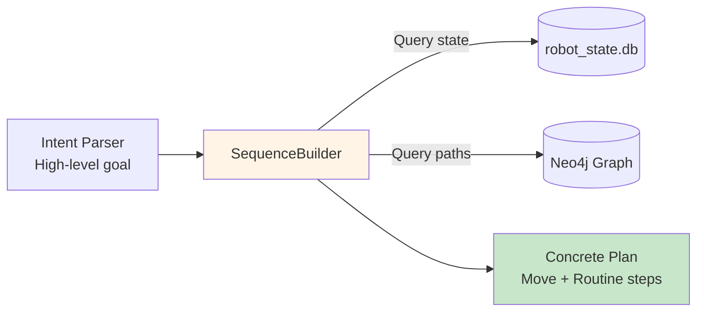
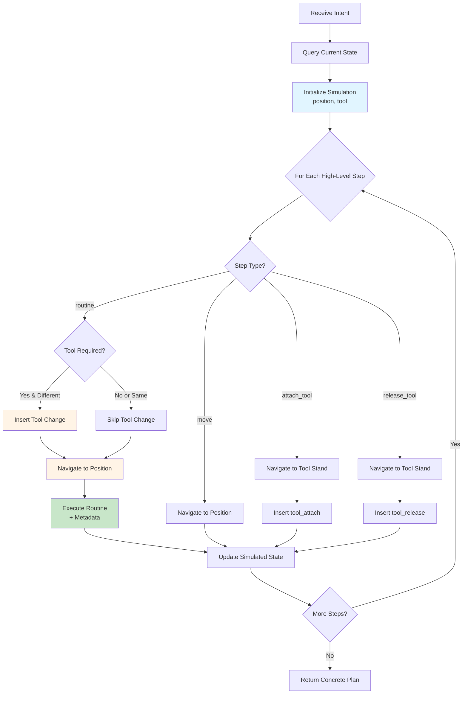
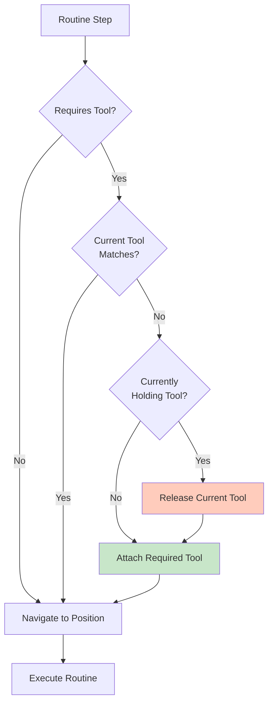

# Sequence Planning - Task Decomposition and Path Generation

> **Note:** Code blocks in this document are **pseudocode and simplified code snippets** for clarity and readability. For actual implementation, see the referenced source files in `src/`.

---

## Overview

The Sequence Builder converts high-level intent from the Intent Parser into concrete, executable step sequences using **deterministic graph algorithms**. No LLM involvement - pure logic and graph traversal.



**Design Philosophy:**
- **LLM parses intent** (WHAT user wants)
- **Sequence Builder plans execution** (HOW to achieve it)
- **Neo4j pathfinding** for navigation
- **Deterministic tool change logic** (no guessing)

---

## Responsibilities

1. **State Simulation** - Track simulated position and tool throughout planning
2. **Tool Change Management** - Insert tool_release/tool_attach steps when needed
3. **Path Generation** - Use Neo4j shortest path for navigation between positions
4. **Metadata Enrichment** - Query routine metadata (stabilize, verify, action_after) from graph
5. **Step Sequencing** - Generate atomic move/routine steps with sequential IDs

---

## Input

**From Intent Parser:**
```python
{
    "goal": "sequence",
    "steps": [
        {"action": "routine", "routine": "tack_weld", "position": "Pos_1"},
        {"action": "routine", "routine": "tack_weld", "position": "Pos_2"}
    ]
}
```

**High-level step types:**
- `{"action": "move", "position": "<position>"}`
- `{"action": "routine", "routine": "<routine>", "position": "<position>"}`
- `{"action": "attach_tool", "tool": "<tool>"}`
- `{"action": "release_tool"}`

---

## Output

**Concrete plan (atomic steps):**
```python
[
    {"id": 1, "name": "Move to Safe_Pos_1", "action": "move", "target": "Safe_Pos_1"},
    {"id": 2, "name": "Move to Tool_Weld_Safe_Position", "action": "move", "target": "Tool_Weld_Safe_Position"},
    {"id": 3, "name": "Move to Tool_Weld_Position", "action": "move", "target": "Tool_Weld_Position"},
    {"id": 4, "name": "Attach Welder", "action": "routine", "target": "tool_attach", 
     "position": "Tool_Weld_Position", "tool": "Welder", "stabilize": 1.5, "verify": "Welder"},
    {"id": 5, "name": "Move to Tool_Weld_Safe_Position", "action": "move", "target": "Tool_Weld_Safe_Position"},
    {"id": 6, "name": "Move to Safe_Pos_1", "action": "move", "target": "Safe_Pos_1"},
    {"id": 7, "name": "Move to Pos_1", "action": "move", "target": "Pos_1"},
    {"id": 8, "name": "Tack Weld at Pos_1", "action": "routine", "target": "tack_weld",
     "position": "Pos_1", "stabilize": 1.5, "verify": "weld_quality_check"},
    {"id": 9, "name": "Move to Safe_Pos_1", "action": "move", "target": "Safe_Pos_1"},
    {"id": 10, "name": "Move to Safe_Pos_2", "action": "move", "target": "Safe_Pos_2"},
    {"id": 11, "name": "Move to Pos_2", "action": "move", "target": "Pos_2"},
    {"id": 12, "name": "Tack Weld at Pos_2", "action": "routine", "target": "tack_weld",
     "position": "Pos_2", "stabilize": 1.5, "verify": "weld_quality_check"}
]
```

**Step types:**
- **move** - Navigate to position (uses graph path)
- **routine** - Execute routine at position (includes tool_attach/tool_release)

---

## Processing Flow



---

## Step-by-Step Loop Processing

The Sequence Builder processes high-level goals **one at a time in a loop**, building up the concrete plan incrementally:

**Loop Structure:**

```python
all_steps = []
step_id = 1

for high_level_step in intent["steps"]:  # Loop through each goal
    # Determine what's needed for THIS goal
    if high_level_step requires tool change:
        all_steps.append(tool_release steps)
        all_steps.append(navigation to tool stand)
        all_steps.append(tool_attach steps)
        update simulated_tool
    
    if high_level_step requires navigation:
        path = neo4j.get_shortest_path(current_pos, target_pos)
        for position in path:
            all_steps.append(move step)
        update simulated_position
    
    all_steps.append(routine execution step)
    step_id += 1

return all_steps  # Complete plan with all inserted steps
```

**Key Points:**
- Each iteration processes ONE high-level goal from Intent Parser
- Sequence Builder inserts whatever additional steps are needed (tool changes, navigation)
- Simulated state is updated after each insertion (position, tool)
- Next iteration uses updated state to determine what's needed
- Result: High-level goals expanded into atomic executable steps

**Example:**
- Intent Parser: `[weld@Pos_1, weld@Pos_2]` (2 high-level goals)
- Loop iteration 1: Insert 6 steps for Pos_1 (tool attach, navigation, weld)
- Loop iteration 2: Insert 6 steps for Pos_2 (navigation, weld) - tool already attached
- Final plan: 12 atomic steps

---

## State Simulation

### Initial State Query

```python
robot_state = state_db.get_state()
simulated_position = robot_state["current_position"]  # e.g., "Home"
simulated_tool = robot_state["current_tool"]          # e.g., "none"
```

**Purpose:** Planning starts from CURRENT robot state, not assumptions

### State Tracking During Planning

```python
# After each step, update simulation
simulated_position = new_position
simulated_tool = new_tool

# Next step uses updated state
if simulated_position != target_position:
    path = neo4j.get_shortest_path(simulated_position, target_position)
```

**Key Insight:** Simulation ensures all paths and tool changes are computed correctly without state conflicts.

---

## Graph Pathfinding

### Algorithm: Neo4j Shortest Path

**Query:**
```cypher
MATCH path = shortestPath(
    (start:Position {name: $from_name})
    -[:ONLY_ALLOWED_MOVE_TO*]-
    (end:Position {name: $to_name})
)
RETURN [node IN nodes(path) | node.name] AS positions
```

**Returns:**
```python
["Home", "Safe_Pos_1", "Pos_1"]  # Full path including start
```

### Path Expansion in Sequence Builder

```python
path = neo4j.get_shortest_path(simulated_position, target_position)
# path = ["Home", "Safe_Pos_1", "Pos_1"]

for pos in path[1:]:  # Skip first position (already there)
    all_steps.append({
        "id": step_id,
        "name": f"Move to {pos}",
        "action": "move",
        "target": pos
    })
    step_id += 1
    simulated_position = pos
```

**Result:**
```python
[
    {"id": 1, "action": "move", "target": "Safe_Pos_1"},
    {"id": 2, "action": "move", "target": "Pos_1"}
]
```

**Why skip path[0]?** Robot already at starting position - only need intermediate waypoints and destination.

---

## Tool Change Logic

### Decision Tree



### Example: Tool Change Sequence

**Scenario:** Robot at Home with no tool, needs Welder for welding at Pos_1

**Step 1: Check Routine Requirements**
```python
routine_info = neo4j.get_routine_by_name("tack_weld")
# Returns: {"name": "tack_weld", "required_tool": "Welder"}

required_tool = routine_info.get("required_tool")  # "Welder"
```

**Step 2: Compare with Current Tool**
```python
if required_tool and required_tool != "none" and simulated_tool != required_tool:
    # Tool change needed
```

**Step 3: Release Current Tool (if any)**
```python
if simulated_tool != "none":
    tool_loc = neo4j.get_tool_locations().get(simulated_tool)
    if tool_loc:
        # Navigate to tool stand if not already there
        if simulated_position != tool_loc:
            path = neo4j.get_shortest_path(simulated_position, tool_loc)
            if path:
                for pos in path[1:]:  # Skip first (already there)
                    all_steps.append({
                        "id": step_id,
                        "name": f"Move to {pos}",
                        "action": "move",
                        "target": pos
                    })
                    step_id += 1
                    simulated_position = pos
        
        # Insert tool_release routine with metadata
        release_step = {
            "id": step_id,
            "name": f"Release {simulated_tool}",
            "action": "routine",
            "target": "tool_release",
            "position": tool_loc,
            "tool": simulated_tool
        }
        
        metadata = neo4j.get_routine_metadata("tool_release", tool_loc)
        if metadata:
            if "stabilize" in metadata and metadata["stabilize"]:
                release_step["stabilize"] = metadata["stabilize"]
            if "action_after" in metadata and metadata["action_after"]:
                release_step["action_after"] = metadata["action_after"]
            if "verify" in metadata and metadata["verify"]:
                release_step["verify"] = metadata["verify"]
        
        all_steps.append(release_step)
        step_id += 1
        simulated_tool = "none"
```

**Step 4: Attach Required Tool**
```python
tool_loc = neo4j.get_tool_locations().get(required_tool)
if tool_loc:
    # Navigate to tool stand if not already there
    if simulated_position != tool_loc:
        path = neo4j.get_shortest_path(simulated_position, tool_loc)
        if path:
            for pos in path[1:]:  # Skip first (already there)
                all_steps.append({
                    "id": step_id,
                    "name": f"Move to {pos}",
                    "action": "move",
                    "target": pos
                })
                step_id += 1
                simulated_position = pos
    
    # Insert tool_attach routine with metadata
    attach_step = {
        "id": step_id,
        "name": f"Attach {required_tool}",
        "action": "routine",
        "target": "tool_attach",
        "position": tool_loc,
        "tool": required_tool
    }
    
    metadata = neo4j.get_routine_metadata("tool_attach", tool_loc)
    if metadata:
        if "stabilize" in metadata and metadata["stabilize"]:
            attach_step["stabilize"] = metadata["stabilize"]
        if "action_after" in metadata and metadata["action_after"]:
            attach_step["action_after"] = metadata["action_after"]
        if "verify" in metadata and metadata["verify"]:
            attach_step["verify"] = metadata["verify"]
    
    all_steps.append(attach_step)
    step_id += 1
    simulated_tool = required_tool
```

---

## Routine Metadata Enrichment

### Query from Graph

```python
metadata = neo4j.get_routine_metadata(routine_name, position_name)
```

**Returns:**
```python
{
    "stabilize": 1.5,         # Wait time before execution (seconds)
    "action_after": "move_safe",  # Post-execution action
    "verify": "weld_quality_check"  # Verification routine
}
```

**Note:** Metadata stored ON `:SUPPORTED_AT` relationships (position-specific)

### Step Enrichment

```python
routine_step = {
    "id": step_id,
    "name": f"{routine_name.replace('_', ' ').title()} at {target_position}",
    "action": "routine",
    "target": routine_name,
    "position": target_position
}

# Add metadata if available
if metadata:
    if "stabilize" in metadata and metadata["stabilize"]:
        routine_step["stabilize"] = metadata["stabilize"]
    if "action_after" in metadata and metadata["action_after"]:
        routine_step["action_after"] = metadata["action_after"]
    if "verify" in metadata and metadata["verify"]:
        routine_step["verify"] = metadata["verify"]

all_steps.append(routine_step)
step_id += 1
```

**Example Result:**
```python
{
    "id": 8,
    "name": "Tack Weld at Pos_1",
    "action": "routine",
    "target": "tack_weld",
    "position": "Pos_1",
    "stabilize": 1.5,
    "verify": "weld_quality_check"
}
```

---

## Step Processing by Intent Type

### 1. Execute Routine

**Input:**
```python
{"action": "routine", "routine": "tack_weld", "position": "Pos_1"}
```

**Processing:**
1. Query routine info: `get_routine_by_name("tack_weld")`
2. Validate support: `get_supported_positions("tack_weld")` - check if Pos_1 in list
3. Check tool requirement: `required_tool = "Welder"`
4. Insert tool change if needed (see Tool Change Logic)
5. Navigate to position: `get_shortest_path(current, "Pos_1")`
6. Query metadata: `get_routine_metadata("tack_weld", "Pos_1")`
7. Insert routine step with metadata

**Output Steps:**
```python
[
    # (tool change steps if needed)
    {"id": 1, "action": "move", "target": "Safe_Pos_1"},
    {"id": 2, "action": "move", "target": "Pos_1"},
    {"id": 3, "action": "routine", "target": "tack_weld", "position": "Pos_1",
     "stabilize": 1.5, "verify": "weld_quality_check"}
]
```

---

### 2. Simple Movement

**Input:**
```python
{"action": "move", "position": "Safe_Pos_2"}
```

**Processing:**
1. Check if already at position: `if simulated_position != "Safe_Pos_2"`
2. Find path: `get_shortest_path(simulated_position, "Safe_Pos_2")`
3. Expand path to move steps (skip first position)

**Output Steps:**
```python
[
    {"id": 1, "action": "move", "target": "Safe_Pos_1"},
    {"id": 2, "action": "move", "target": "Home"},
    {"id": 3, "action": "move", "target": "Safe_Pos_2"}
]
```

---

### 3. Attach Tool

**Input:**
```python
{"action": "attach_tool", "tool": "Camera"}
```

**Processing:**
1. Query tool location: `get_tool_locations()["Camera"]` → "Tool_Camera_Position"
2. Navigate to tool stand: `get_shortest_path(current, "Tool_Camera_Position")`
3. Query metadata: `get_routine_metadata("tool_attach", "Tool_Camera_Position")`
4. Insert tool_attach step with metadata
5. Update simulated tool: `simulated_tool = "Camera"`

**Output Steps:**
```python
[
    {"id": 1, "action": "move", "target": "Tool_Camera_Safe_Position"},
    {"id": 2, "action": "move", "target": "Tool_Camera_Position"},
    {"id": 3, "action": "routine", "target": "tool_attach",
     "position": "Tool_Camera_Position", "tool": "Camera",
     "stabilize": 1.5, "verify": "Camera"}
]
```

---

### 4. Release Tool

**Input:**
```python
{"action": "release_tool"}
```

**Processing:**
1. Check current tool: `if simulated_tool != "none"`
2. Query tool location: `get_tool_locations()[simulated_tool]`
3. Navigate to tool stand: `get_shortest_path(current, tool_location)`
4. Query metadata: `get_routine_metadata("tool_release", tool_location)`
5. Insert tool_release step with metadata
6. Update simulated tool: `simulated_tool = "none"`

**Output Steps:**
```python
[
    {"id": 1, "action": "move", "target": "Tool_Weld_Safe_Position"},
    {"id": 2, "action": "move", "target": "Tool_Weld_Position"},
    {"id": 3, "action": "routine", "target": "tool_release",
     "position": "Tool_Weld_Position", "tool": "Welder",
     "stabilize": 1.0, "verify": "Welder"}
]
```

---

## Complete Example: Multi-Step Welding Task

### Intent (from Intent Parser)

```python
{
    "goal": "sequence",
    "steps": [
        {"action": "routine", "routine": "tack_weld", "position": "Pos_1"},
        {"action": "routine", "routine": "tack_weld", "position": "Pos_2"}
    ]
}
```

### Initial State

```python
current_position = "Home"
current_tool = "none"
```

### Planning Process

#### Step 1: Process First Routine (Pos_1)

1. **Check Tool Requirement**
   - tack_weld requires "Welder"
   - Current tool: "none"
   - **Action:** Attach Welder

2. **Navigate to Tool Stand**
   - Path: Home → Tool_Weld_Safe_Position → Tool_Weld_Position
   - Insert move steps: id=1, id=2

3. **Attach Tool**
   - Insert tool_attach: id=3
   - Update simulated_tool = "Welder"

4. **Navigate to Work Position**
   - Path: Tool_Weld_Position → Tool_Weld_Safe_Position → Safe_Pos_1 → Pos_1
   - Insert move steps: id=4, id=5, id=6

5. **Execute Routine**
   - Query metadata: stabilize=1.5, verify="weld_quality_check"
   - Insert tack_weld: id=7

#### Step 2: Process Second Routine (Pos_2)

1. **Check Tool Requirement**
   - tack_weld requires "Welder"
   - Current tool: "Welder"
   - **Action:** No tool change needed

2. **Navigate to Work Position**
   - Path: Pos_1 → Safe_Pos_1 → Home → Safe_Pos_2 → Pos_2
   - Insert move steps: id=8, id=9, id=10, id=11

3. **Execute Routine**
   - Query metadata: stabilize=1.5, verify="weld_quality_check"
   - Insert tack_weld: id=12

### Final Plan (12 Steps)

```python
[
    {"id": 1, "action": "move", "target": "Tool_Weld_Safe_Position"},
    {"id": 2, "action": "move", "target": "Tool_Weld_Position"},
    {"id": 3, "action": "routine", "target": "tool_attach",
     "position": "Tool_Weld_Position", "tool": "Welder", "stabilize": 1.5, "verify": "Welder"},
    {"id": 4, "action": "move", "target": "Tool_Weld_Safe_Position"},
    {"id": 5, "action": "move", "target": "Safe_Pos_1"},
    {"id": 6, "action": "move", "target": "Pos_1"},
    {"id": 7, "action": "routine", "target": "tack_weld",
     "position": "Pos_1", "stabilize": 1.5, "verify": "weld_quality_check"},
    {"id": 8, "action": "move", "target": "Safe_Pos_1"},
    {"id": 9, "action": "move", "target": "Home"},
    {"id": 10, "action": "move", "target": "Safe_Pos_2"},
    {"id": 11, "action": "move", "target": "Pos_2"},
    {"id": 12, "action": "routine", "target": "tack_weld",
     "position": "Pos_2", "stabilize": 1.5, "verify": "weld_quality_check"}
]
```

---

## Validation During Planning

### Routine Support Check

```python
supported_positions = neo4j.get_supported_positions(routine_name)
if target_position not in supported_positions:
    raise ValueError(
        f"Routine '{routine_name}' is not supported at position '{target_position}'. "
        f"Valid positions: {supported_positions}"
    )
```

**Purpose:** Early validation prevents invalid plans from reaching Verifier

### Path Existence Check

```python
path = neo4j.get_shortest_path(from_position, to_position)
if not path:
    # No valid path exists - cannot reach position
    # Raises exception or returns empty plan
```

**Note:** Graph structure guarantees path validity (edges define allowed moves)

---

## Database Queries Summary

### Neo4j Queries (per plan)

1. **State Query** (run once at start, start position and tool = simulated position and tool)
   - `get_state()` - Get current position and tool

2. **Routine Queries** (per routine step)
   - `get_routine_by_name(routine)` - Get tool requirement
   - `get_supported_positions(routine)` - Validate position support
   - `get_routine_metadata(routine, position)` - Get stabilize/verify/action_after

3. **Tool Queries** (per tool change)
   - `get_tool_locations()` - Map tool to position

4. **Path Queries** (per navigation)
   - `get_shortest_path(from, to)` - Find route between positions

**Query Efficiency:** Queries executed on-demand, not upfront batch (lazy evaluation)

---

## Key Design Principles

### 1. Deterministic Planning
- No LLM guessing or heuristics
- All decisions based on graph data
- Predictable, repeatable output

### 2. State Simulation
- Track simulated position/tool throughout planning
- Each step builds on previous state
- Prevents state conflicts

### 3. Automatic Tool Management
- Tool changes inserted automatically
- No manual tool attach/release in high-level intent
- Robot always has correct tool for routine

### 4. Graph-Driven Navigation
- Neo4j shortest path for all movement
- Respects :ONLY_ALLOWED_MOVE_TO edges
- Impossible to generate invalid paths

### 5. Metadata Integration
- Every routine step enriched with metadata
- Position-specific behavior (different stabilize times)
- Metadata stored in graph, not hardcoded

---

## Error Handling

### Planning Failures

**Scenario 1: No Path Exists**
```python
# Go to position 4
path = neo4j.get_shortest_path("Home", "Pos_4")
# Returns None - positions not connected
```
**Handling:** Exception raised, caught by workflow, triggers re-parsing with error feedback

**Scenario 2: Routine Not Supported**
```python
# User: Weld at safe position 1
supported = neo4j.get_supported_positions("tack_weld")
# ["Pos_1", "Pos_2", "Pos_3"]
# User requested "Safe_Pos_1" (not in list)
```
**Handling:** ValueError raised with valid positions list, triggers re-parsing

**Scenario 3: Tool Location Unknown**
```python
# User: Attach gripper
tool_locations = neo4j.get_tool_locations()
# {"Welder": "Tool_Weld_Position", "Camera": "Tool_Camera_Position"}
# User requested "Gripper" (not in dict)
```
**Handling:** Returns None, step skipped or exception raised

---

## Logging and Observability

**Start of Planning:**
```json
{
    "service": "sequence_builder",
    "message": "Building step sequence",
    "correlation_id": "abc-123",
    "high_level_steps": 2
}
```

**End of Planning:**
```json
{
    "service": "sequence_builder",
    "message": "Step sequence built",
    "correlation_id": "abc-123",
    "high_level_steps": 2,
    "concrete_steps": 12
}
```

---

## Summary

**Sequence Builder:**
- Converts high-level intent into atomic move/routine steps
- Uses Neo4j shortest path for navigation
- Automatically manages tool changes
- Enriches steps with position-specific metadata
- Simulates state to ensure consistency
- Deterministic (no LLM, no guessing)

**Input:** Structured intent (goal + steps)  
**Output:** Concrete plan (move + routine with metadata)  
**Database:** Neo4j (paths, metadata), SQLite (current state)  
**Next Step:** Plan sent to Human Review for operator approval
