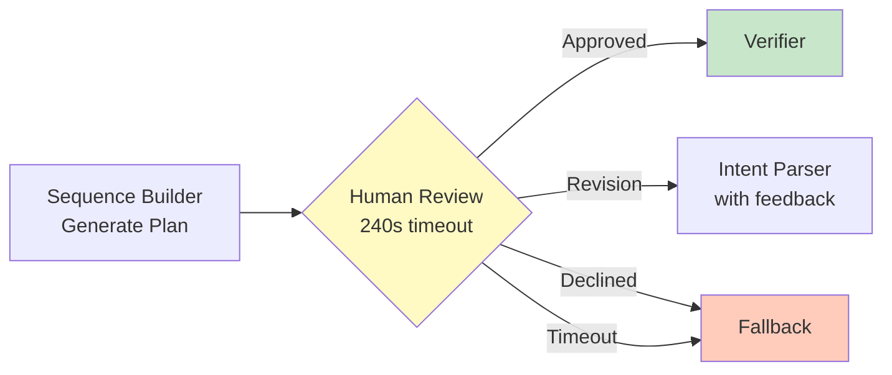
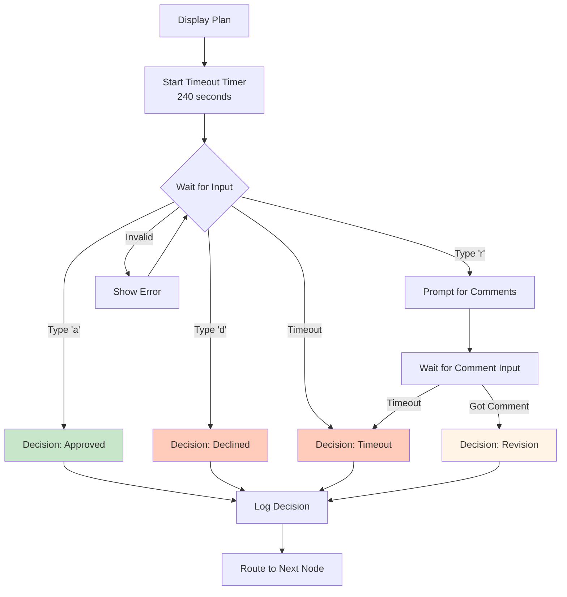

# Human Review - Operator Approval Gate

> **Note:** Code blocks in this document are **pseudocode and simplified code snippets** for clarity and readability. For actual implementation, see the referenced source files in `src/`.

---

## Overview

The Human Review node is a **blocking approval gate** that requires operator consent before plan execution. This ensures human oversight for safety-critical robot operations.

**File:** `src/core/translation/nodes/human_review.py`



**Design Principle:** Human operator is the final authority on robot actions. System proposes, human disposes.

---

## Responsibilities

1. **Plan Display** - Present generated plan in human-readable format
2. **Decision Collection** - Wait for operator input (approve/revise/decline)
3. **Timeout Enforcement** - Abort after 240 seconds without response
4. **Revision Feedback** - Collect operator comments for plan refinement
5. **State Routing** - Direct workflow based on decision

---

## Configuration

### Timeout Setting

```python
HUMAN_REVIEW_TIMEOUT = int(os.getenv("HUMAN_REVIEW_TIMEOUT", "120"))
```

**Default:** 120 seconds (2 minutes)  
**Purpose:** Balance between safety (sufficient review time) and efficiency (prevent indefinite waiting)

---

## Input

**From Sequence Builder:**
```python
{
    "correlation_id": "abc-123",
    "operator_input": "weld at position 1 and 2",
    "plan": [
        {"id": 1, "action": "move", "target": "Safe_Pos_1", "name": "Move to Safe_Pos_1"},
        {"id": 2, "action": "move", "target": "Pos_1", "name": "Move to Pos_1"},
        {"id": 3, "action": "routine", "target": "tack_weld", "position": "Pos_1",
         "name": "Tack Weld at Pos_1", "stabilize": 1.5, "verify": "weld_quality_check"},
        # ... more steps
    ]
}
```

---

## Output

**Decision: Approved**
```python
{
    "human_decision": "approved",
    "human_comments": None
}
```
**Routing:** → Verifier

---

**Decision: Revision**
```python
{
    "human_decision": "revision",
    "human_comments": "Skip position 2, too risky today"
}
```
**Routing:** → Intent Parser (with feedback for re-parsing)

---

**Decision: Declined**
```python
{
    "human_decision": "declined",
    "human_comments": None
}
```
**Routing:** → Fallback (task cancelled)

---

**Decision: Timeout**
```python
{
    "human_decision": "timeout",
    "human_comments": None
}
```
**Routing:** → Fallback (no response)

---

## Plan Display Format

### CLI Presentation

```

================================================================================
PLAN REVIEW REQUIRED
================================================================================
Correlation ID: abc-123-def-456
Your command: weld at position 1 and 2

Generated Plan:

Generated Plan :
  [1]  Move to Tool_Weld_Safe_Position
  [2]  Move to Tool_Weld_Position
  [3]  Attach Welder 
  [4]  Move to Tool_Weld_Safe_Position
  [5]  Move to Safe_Pos_1
  [6]  Move to Pos_1
  [7]  Tack Weld at Pos_1 
  [8]  Move to Safe_Pos_1
  [9]  Move to Home
  [10] Move to Safe_Pos_2
  [11] Move to Pos_2
  [12] Tack Weld at Pos_2

================================================================================
Options:
  [a] Approve - Execute this plan
  [r] Revise - Request changes (provide comments)
  [d] Decline - Cancel this task
================================================================================
Timeout: 240 seconds
================================================================================

Your decision [a/r/d]: _
```

**Format Elements:**
- Correlation ID for tracking
- Original operator command for context
- Step-by-step plan with IDs
- Clear decision options

---

## Decision Processing

### Flow Diagram



---

### 1. Approve (a)

**Operator Action:** Types 'a' and presses Enter

**System Behavior:**
```python
decision = "approved"
comments = None
```

**Routing Condition:**
```python
def human_review_condition(state):
    if state["human_decision"] == "approved":
        return "verify"  # → Verifier node
```

**Use Case:** Plan looks correct, proceed with execution

---

### 2. Revise (r)

**Operator Action:**
1. Types 'r' and presses Enter
2. System prompts: "What changes do you want?"
3. Operator types comments: "Skip position 2, too risky"
4. Presses Enter

**System Behavior:**
```python
decision = "revision"
comments = "Skip position 2"
```

**Routing Condition:**
```python
def human_review_condition(state):
    if state["human_decision"] == "revision":
        return "sequence_planning"  # → Intent Parser (re-parse with feedback)
```

**Feedback Loop:**
1. Intent Parser receives `human_comments` in state
2. LLM prompt includes: "Operator Revision Feedback: Skip position 2"
3. LLM adjusts intent based on feedback
4. Sequence Builder regenerates plan
5. Plan returns to Human Review for re-approval

**Use Case:** When plan mostly correct but needs adjustments (skip positions, change order, etc.)

---

### 3. Decline (d)

**Operator Action:** Types 'd' and presses Enter

**System Behavior:**
```python
decision = "declined"
comments = None
```

**Routing Condition:**
```python
def human_review_condition(state):
    if state["human_decision"] in ["declined", "timeout"]:
        return "fallback"  # → Fallback node (error message)
```

**Use Case:** Plan is incorrect, unsafe, or operator changed mind

---

### 4. Timeout (automatic)

**Operator Action:** No input within 240 seconds or other defined amount.

**System Behavior:**
```python
def prompt_operator_cli(...):
    end_time = time.time() + HUMAN_REVIEW_TIMEOUT
    
    while True:
        remaining = max(0, int(end_time - time.time()))
        if remaining == 0:
            print("\nHuman review timeout exceeded. Routing to fallback.")
            logger.warning("Human review timeout", correlation_id=correlation_id)
            return ("timeout", None)
```

**Routing Condition:** Same as Decline → Fallback

**Use Case:** Operator walked away, distracted, or system unattended

---

## Logging and Observability

### Start of Review

```json
{
    "ts": "2025-10-19T09:30:33.331857Z",
    "service": "human_review",
    "level": "INFO",
    "message": "Presenting plan for human review",
    "correlation_id": "abc-123",
    "timeout_seconds": 240
}
```

### Decision Recorded

```json
{
    "ts": "2025-10-19T09:30:54.219874Z",
    "service": "human_review",
    "level": "INFO",
    "message": "Human decision recorded",
    "correlation_id": "abc-123",
    "decision": "approved"
}
```

### Timeout Event

```json
{
    "ts": "2025-10-19T09:34:33.331857Z",
    "service": "human_review",
    "level": "WARNING",
    "message": "Human review timeout",
    "correlation_id": "abc-123"
}
```

**Metrics from Logs:**
- Review duration = decision timestamp - presentation timestamp
- Approval rate = approved / (approved + declined)
- Revision rate = revision / total
- Timeout frequency = timeout / total

---

## Error Handling

### Invalid Input

**Scenario:** Operator types invalid option (e.g., 'x')

**Handling:**
```python
else:
    print("Invalid choice. Please enter 'a', 'r', or 'd'.")
    # Loop continues, timeout still enforced
```

**Note:** Does NOT restart timeout - clock keeps ticking

---

### Comment Timeout

**Scenario:** Operator chooses revision ('r') but doesn't enter comments before timeout

**Handling:**
```python
elif choice == "r":
    remaining = max(0, int(end_time - time.time()))
    if remaining == 0:
        print("Timeout exceeded while waiting for comments.")
        return ("timeout", None)
    
    print("What changes do you want? ", end='')
    comments = sys.stdin.readline().strip()
    return ("revision", comments)
```

**Result:** Treated as timeout, routes to Fallback

---

### Empty Comments

**Scenario:** Operator chooses revision ('r') but enters empty string

**Handling:** System accepts empty comments (treated as generic "revise request")

**LLM Behavior:** Without specific feedback, LLM may not change intent significantly

---

## Integration with Workflow

### Conditional Routing

```python
def human_review_condition(state: WorkflowState) -> str:
    """
    Determines next node based on human decision.
    
    Returns:
        "verify" (approved) | "sequence_planning" (revision) | "fallback" (declined/timeout)
    """
    decision = state.get("human_decision")
    
    if decision == "approved":
        return "verify"
    elif decision == "revision":
        return "sequence_planning"
    else:
        # declined or timeout
        return "fallback"
```

### Workflow Graph Integration

```python
# In workflow definition
workflow.add_conditional_edges(
    "human_review",
    human_review_condition,
    {
        "verify": "verify",
        "sequence_planning": "sequence_planning",
        "fallback": "fallback"
    }
)
```

---

## Key Design Principles

### 1. Blocking by Design
- Human Review is intentionally synchronous
- Workflow pauses until operator decides
- No background execution without approval

### 2. Safety First
- Operator can stop any plan (decline)
- Timeout prevents indefinite waiting
- Revision allows plan refinement without starting over

### 3. Feedback Loop Integration
- Revision comments passed to Intent Parser
- LLM changes descisions from operator corrections
- System adapts to operator intent

### 4. Transparency
- Full plan displayed before execution
- Original command shown for context

### 5. Timeout as Safety Mechanism
- Prevents unattended execution
- Ensures operator engagement
- Treats absence as implicit decline

---

## Use Cases

### Normal Operation (Approve)

**Scenario:** Operator requests "weld at position 1", reviews plan, approves

**Flow:**
1. Plan displayed: 8 steps (tool change + navigation + weld)
2. Operator reviews: 15 seconds
3. Operator types 'a'
4. System proceeds to Verifier

---

### Plan Refinement (Revise)

**Scenario:** Operator requests "weld at all positions", reviews plan, realizes position 2 is obstructed

**Flow:**
1. Plan displayed: 18 steps (welds at Pos_1, Pos_2, Pos_3)
2. Operator reviews: 30 seconds
3. Operator types 'r'
4. Operator enters: "Skip position 2, obstruction detected"
5. Intent Parser re-parses with feedback
6. New plan generated: 12 steps (only Pos_1, Pos_3)
7. Plan displayed again
8. Operator reviews: 10 seconds
9. Operator types 'a'
10. System proceeds to Verifier


---

### Safety Abort (Decline)

**Scenario:** Operator requests task, reviews plan, realizes wrong tool in plan

**Flow:**
1. Plan displayed: 10 steps (uses Camera instead of Welder)
2. Operator reviews: 20 seconds
3. Operator notices error
4. Operator types 'd'
5. System routes to Fallback
6. Operator sees error message: "Task declined by operator"
7. Operator issues corrected command


---

### Unattended System (Timeout)

**Scenario:** Operator requests task, walks away before reviewing

**Flow:**
1. Plan displayed
2. No operator input
3. System waits 240 seconds
4. Timeout triggered
5. System routes to Fallback
6. Operator returns, sees timeout message

---

## Summary

**Human Review:**
- Blocking approval gate before execution
- 240-second timeout (configurable)
- Three decision options: approve, revise, decline
- Automatic timeout handling
- Revision feedback loop to Intent Parser
- Full plan transparency (all steps)

**Decision Outcomes:**
- **Approved:** → Verifier (safety checks)
- **Revision:** → Intent Parser (re-parse with feedback)
- **Declined:** → Fallback (task cancelled)
- **Timeout:** → Fallback (no response)

**Safety Features:**
- Operator is final authority
- No execution without explicit approval
- Timeout prevents unattended runs
- Full plan visibility before commitment

**Next Step:** If approved, plan sent to Verifier for safety validation against graph constraints.
