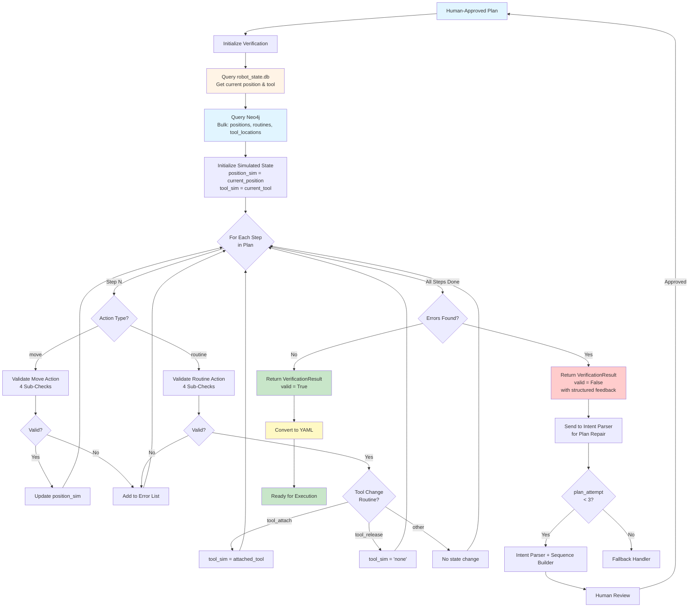
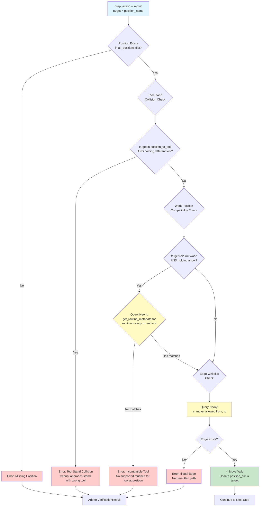
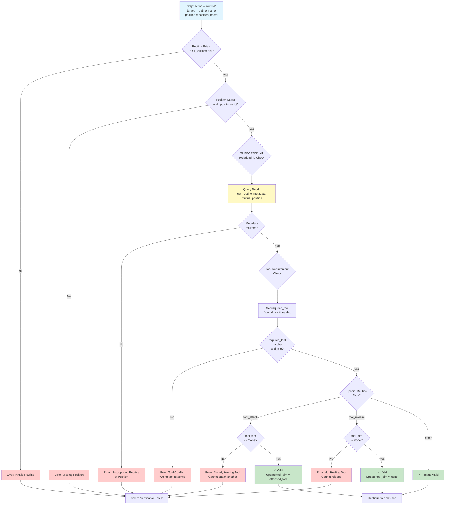
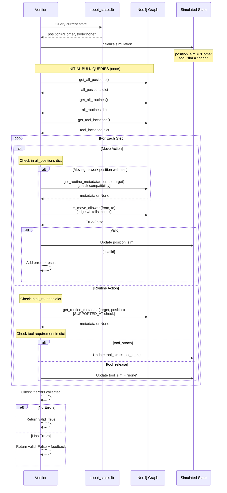
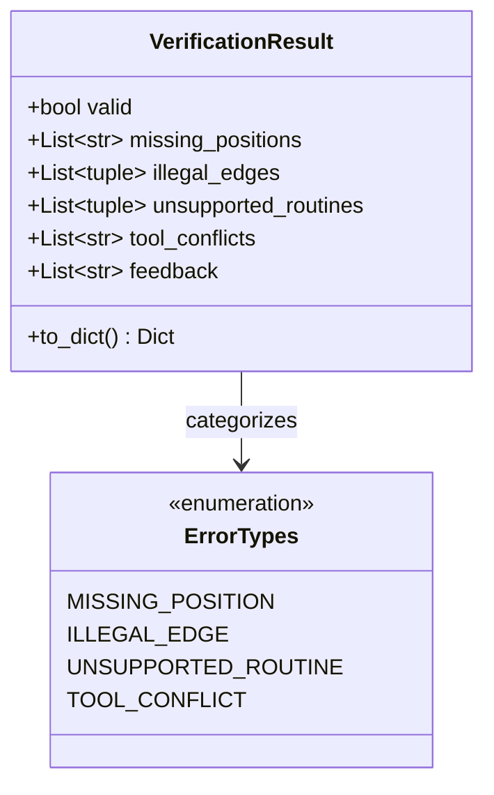

# Verification Layer - Safety Validation and YAML Output

> **Note:** Code blocks in this document are **pseudocode and simplified code snippets** for clarity and readability. For actual implementation, see the referenced source files in `src/`.

## Overview

The Verification Layer performs safety-critical validation before allowing execution. This layer checks the planned sequence against the Neo4j knowledge graph to ensure all positions exist, all moves are permitted, all routines are supported, and tool requirements are consistent. Verified plans are converted to YAML format to be further processed by the robot layer.

**Key Responsibilities:**
- Validate position existence (all positions must exist in Neo4j)
- Validate movement edges (only :ONLY_ALLOWED_MOVE_TO relationships permitted)
- Validate routine support (routines must have :SUPPORTED_AT relationships)
- Validate tool requirements (detect conflicts and mismatches)
- Simulate state during validation (prevent tool stand collisions)
- Convert validated plans to YAML format
- Retry planning on validation failure (max 3 attempts with feedback)

**Input:** Human-approved JSON plan from Human Review  
**Output:** YAML sequence written to `actions.yaml`

---

## Verification Process Flow

### High-Level Flow



**Core Process:**
1. Receive human-approved JSON plan from Human Review
2. Query robot_state.db for current position/tool
3. Query Neo4j once for bulk data (positions, routines, tool_locations)
4. Initialize simulated state
5. Iterate through each step, performing validation checks with per-step Neo4j queries when needed
6. Collect errors during iteration
7. If valid → convert to YAML and write `actions.yaml`
8. If invalid → send structured feedback to Intent Parser for plan repair
9. Repaired plan goes back to Human Review for approval
10. If max attempts exceeded → route to Fallback Handler

---

## Detailed Validation Flows

### Move Action Validation



**Move Validation Checks:**
1. **Position Existence** - Check in `all_positions` dict (loaded once at start)
2. **Tool Stand Collision** - Check in `position_to_tool` dict (loaded once at start)
3. **Work Position Compatibility** - Query Neo4j: `get_routine_metadata()` for each routine using current tool
4. **Edge Whitelist** - Query Neo4j: `is_move_allowed(from, to)` to check `:ONLY_ALLOWED_MOVE_TO` edge exists

---

### Routine Action Validation



**Routine Validation Checks:**
1. **Routine Existence** - Check in `all_routines` dict (loaded once at start)
2. **Position Existence** - Check in `all_positions` dict (loaded once at start)
3. **SUPPORTED_AT Relationship** - Query Neo4j: `get_routine_metadata(routine, position)` to check edge exists
4. **Tool Requirement** - Check `required_tool` from `all_routines` dict against `tool_sim`
5. **Special Routine Handling** - For `tool_attach`/`tool_release`, validate state and update `tool_sim`

---

### State Simulation Sequence



**Query Strategy:**
- **Bulk queries (once at start):** Load all positions, routines, and tool locations into dictionaries
- **Per-step queries (inside loop):** 
  - `is_move_allowed(from, to)` for every move action
  - `get_routine_metadata(routine, position)` for work position compatibility and routine validation

---

## Verification Checks

### Check 1: Position Existence

**Purpose:** Ensure all positions referenced in the plan exist in the Neo4j graph.

**Process:**
1. Extract all position names from plan steps (move targets, routine locations)
2. Query Neo4j for each position: `MATCH (p:Position {name: $name}) RETURN p`
3. If any position not found → `missing_positions` list populated

**Example Failure:**
```json
{
  "valid": false,
  "missing_positions": ["Pos_99"],
  "feedback": "Position Pos_99 does not exist in graph"
}
```

**Implementation Logic:**
```
FOR each unique position in plan:
    IF position does NOT exist in Neo4j:
        ADD position to missing_positions list
        SET result.valid = False
        ADD error message to feedback
```

*See `src/core/verification/verifier.py` for full implementation*

---

### Check 2: Movement Safety Checks

**Purpose:** Ensure all robot movements are safe and valid.

**Process (performed for each `move` step):**

1. **Position Existence:** Check if target position exists in Neo4j
2. **Tool Stand Collision Prevention:** If target is a tool stand position, ensure robot is NOT holding a different tool
3. **Work Position Compatibility:** If moving to a work position while holding a tool, ensure at least one routine using that tool is supported at that position
4. **Edge Whitelist:** Check if `:ONLY_ALLOWED_MOVE_TO` edge exists from current position to target

**Example Failure (Tool Stand Collision):**
```json
{
  "valid": false,
  "tool_conflicts": ["Step 3: Cannot move to 'Tool_Weld_Position' (tool stand for 'Welder') while holding 'Camera'"],
  "feedback": "Step 3: Collision risk - must release 'Camera' before approaching 'Welder' tool stand"
}
```

**Example Failure (Illegal Edge):**
```json
{
  "valid": false,
  "illegal_edges": [{"from": "Home", "to": "Pos_5"}],
  "feedback": "Step 2: No :ONLY_ALLOWED_MOVE_TO edge from 'Home' to 'Pos_5'"
}
```

**Implementation Logic:**
```
FOR each move step in plan:
    // Check 1: Position exists
    IF target NOT in all_positions:
        Mark as invalid, add to missing_positions
        CONTINUE to next step
    
    // Check 2: Tool stand collision prevention
    IF target is a tool stand position:
        IF robot holding a DIFFERENT tool than the one at this stand:
            Mark as invalid, add to tool_conflicts
            CONTINUE to next step
    
    // Check 3: Work position compatibility
    IF target is work position AND robot holding a tool:
        IF NO routines using this tool are supported at target:
            Mark as invalid, add to tool_conflicts
            CONTINUE to next step
    
    // Check 4: Edge whitelist
    IF NO :ONLY_ALLOWED_MOVE_TO edge from current to target:
        Mark as invalid, add to illegal_edges
        Add feedback message
    ELSE:
        UPDATE simulated_position to target
```

*See `src/core/verification/verifier.py`  for full implementation*

**Note:** Uses simulated state tracking (`simulated_position`, `simulated_tool`) to validate entire sequence.

---

### Check 3: Routine Validation

**Purpose:** Ensure all routines are valid and can be performed at their specified positions.

**Process (performed for each `routine` step):**
1. Check if routine exists in Neo4j
2. Check if position exists in Neo4j (for work routines)
3. Query Neo4j for `:SUPPORTED_AT` relationship metadata
4. Validate tool requirements match current tool state

**Example Failure (Unsupported Routine):**
```json
{
  "valid": false,
  "unsupported_routines": [{"routine": "tackweld", "position": "Pos_2"}],
  "feedback": "Step 5: Routine 'tackweld' not supported at 'Pos_2' (no :SUPPORTED_AT edge)"
}
```

**Example Failure (Tool Mismatch):**
```json
{
  "valid": false,
  "tool_conflicts": ["Step 7: Routine 'tackweld' requires tool 'Welder', but robot has 'Camera'"],
  "feedback": "Step 7: Tool mismatch - need 'Welder', have 'Camera'"
}
```

**Implementation Logic:**
```
FOR each routine step in plan:
    // Check 1: Routine exists
    IF routine NOT in all_routines:
        Mark as invalid, add feedback
        CONTINUE to next step
    
    // Check 2: Position exists (for work routines)
    IF position specified AND position NOT in all_positions:
        Mark as invalid, add to missing_positions
        CONTINUE to next step
    
    // Check 3: :SUPPORTED_AT relationship
    IF position specified:
        IF NO :SUPPORTED_AT edge between routine and position:
            Mark as invalid, add to unsupported_routines
    
    // Check 4: Tool requirements
    IF routine requires a tool:
        IF simulated_tool does NOT match required_tool:
            Mark as invalid, add to tool_conflicts
    
    // Update simulated tool state
    IF routine is "tool_attach":
        IF already holding a tool:
            Mark as invalid (cannot attach while holding)
        ELSE:
            UPDATE simulated_tool to the tool at this position
    
    ELSE IF routine is "tool_release":
        IF NOT holding any tool:
            Mark as invalid (nothing to release)
        ELSE:
            UPDATE simulated_tool to "none"
```

*See `src/core/verification/verifier.py` for full implementation*

---

## Verification Result Structure



**Class Structure:**
```
CLASS VerificationResult:
    valid: bool                          // Overall validation status
    missing_positions: List[str]         // Check 1 failures
    illegal_edges: List[tuple]           // Check 2 failures (from, to)
    unsupported_routines: List[tuple]    // Check 3 failures (routine, position)
    tool_conflicts: List[str]            // Check 4 failures
    feedback: List[str]                  // Human-readable error messages
    
    METHOD to_dict():
        RETURN {
            "valid": valid,
            "missing_positions": missing_positions,
            "illegal_edges": [{"from": a, "to": b} for each edge],
            "unsupported_routines": [{"routine": r, "position": p} for each],
            "tool_conflicts": tool_conflicts,
            "feedback": JOIN(feedback, "\n")
        }
```

*See `src/core/verification/verifier.py` for implementation*

**Example Valid Result:**
```python
{
    "valid": True,
    "missing_positions": [],
    "illegal_edges": [],
    "unsupported_routines": [],
    "tool_conflicts": [],
    "feedback": ""
}
```

**Example Invalid Result:**
```python
{
    "valid": False,
    "missing_positions": [],
    "illegal_edges": [
        {"from": "Home", "to": "Pos_1"}
    ],
    "unsupported_routines": [],
    "tool_conflicts": [],
    "feedback": "Step 2: No :ONLY_ALLOWED_MOVE_TO edge from 'Home' to 'Pos_1'"
}
```

---

## YAML Conversion

### Purpose

Convert validated JSON plan (the systems internal language) to YAML format required by the robot controller.


### YAML Format

```yaml
name: "Robot Sequence"
description: "Weld at position 1"
steps:
  - id: 1
    name: "Move to Home"
    action: "move"
    target: "Home"
  
  - id: 2
    name: "Move to Tool_Weld_Safe_Position"
    action: "move"
    target: "Tool_Weld_Safe_Position"
  
  - id: 3
    name: "Move to Tool_Weld_Position"
    action: "move"
    target: "Tool_Weld_Position"
  
  - id: 4
    name: "Attach Welder"
    action: "routine"
    target: "tool_attach"
    position: "Tool_Weld_Position"
    tool: "Welder"
    stabilize: 1.5
    action_after: "attach_tool"
    verify: "Welder"
  
  - id: 5
    name: "Move to Tool_Weld_Safe_Position"
    action: "move"
    target: "Tool_Weld_Safe_Position"
  
  - id: 6
    name: "Move to Home"
    action: "move"
    target: "Home"
  
  - id: 7
    name: "Move to Safe_Pos_1"
    action: "move"
    target: "Safe_Pos_1"
  
  - id: 8
    name: "Move to Pos_1"
    action: "move"
    target: "Pos_1"
  
  - id: 9
    name: "Tack Weld at Pos_1"
    action: "routine"
    target: "tack_weld"
    position: "Pos_1"
    stabilize: 1.5
    verify: "weld_quality_check"
```

### Conversion Code

**Function Signature:**
```
convert_to_yaml(
    plan: List[Dict],
    sequence_name: str,
    description: str,
    correlation_id: str
) -> str
```

**Logic:**
```
CREATE robot_sequence = {
    "RobotSequence": {
        "name": sequence_name,
        "description": description,
        "steps": plan
    }
}

CONVERT robot_sequence to YAML format with:
    - No flow style (use block style)
    - Preserve key order
    - 2-space indentation
    - Unicode support

RETURN yaml_string
```

*See `src/core/verification/yaml_converter.py` for implementation*

---

## Retry Logic

### Max Attempts

**Configuration:** `MAX_PLAN_ATTEMPTS` environment variable (default: 3)

**Process:**
1. Plan generated by Sequence Builder
2. Human approves plan
3. Verify Node validates plan
4. If validation fails:
   - Increment `plan_attempt` counter
   - Generate structured feedback from `VerificationResult`
   - Check if `plan_attempt < MAX_PLAN_ATTEMPTS`
   - If yes → route back to Sequence Planning with feedback
   - If no → route to Fallback Handler

### Feedback Generation

Feedback is generated **incrementally during validation** in `verify_plan()`. Each failed check appends a detailed message to the `result.feedback` list. The `to_dict()` method joins these messages for return to the workflow.

**Feedback Logic:**
```
CREATE result = VerificationResult()

// During validation, append specific error messages:
IF position missing:
    ADD "Step {i}: Position '{name}' does not exist in graph" to feedback

IF illegal edge:
    ADD "Step {i}: No :ONLY_ALLOWED_MOVE_TO edge from '{from}' to '{to}'" to feedback

IF tool conflict:
    ADD "Step {i}: Routine '{name}' requires tool '{required}', but robot has '{current}'" to feedback
    ADD "Step {i}: Tool mismatch - need '{required}', have '{current}'" to feedback

// At the end:
RETURN result  // to_dict() joins all feedback with newlines
```

The feedback is then passed to the sequence planner for retry via the `validation_errors` state field.

*See `src/core/verification/verifier.py` for implementation details*

---

## Key Implementation Details

### No Pydantic/Schema Validation
- The verifier does NOT use Pydantic models or formal schema validation
- Plan is a simple `List[Dict[str, Any]]` passed from Sequence Builder
- Validation happens inline as steps are iterated using dictionary lookups and Neo4j queries
- Uses custom `VerificationResult` class for structured output

### Hybrid Query Strategy
- **Bulk queries once at start:** Load positions, routines, and tool locations into dictionaries for fast lookups
- **Targeted queries per step:** Query Neo4j for relationship checks (`is_move_allowed`, `get_routine_metadata`)
- This approach balances performance (dictionary lookups) with accuracy (live graph queries for relationships)

### Graph Queries Used

**Initial Bulk Queries (once at start):**
- `get_all_positions()` - Load all positions with roles into dictionary
- `get_all_routines()` - Load all routines with tool requirements into dictionary
- `get_tool_locations()` - Load tool→position mapping for collision checks

**Per-Step Queries (inside validation loop):**
- `is_move_allowed(from, to)` - Called for EVERY move action to validate `:ONLY_ALLOWED_MOVE_TO` edge exists
- `get_routine_metadata(routine, position)` - Called for:
  - Work position compatibility checks (when moving to work position with tool)
  - Every routine action to validate `:SUPPORTED_AT` relationship

### Error Categories
1. **Missing Positions** - Position name not in graph
2. **Illegal Edges** - No `:ONLY_ALLOWED_MOVE_TO` relationship
3. **Unsupported Routines** - No `:SUPPORTED_AT` relationship
4. **Tool Conflicts** - Wrong tool, duplicate attach, invalid release, tool stand collision, work position incompatibility

### Logging
All verification attempts are logged to `logs/verification/verify_*.jsonl` with:
- `correlation_id` - Links to original request
- `step_count` - Number of steps validated
- `validation_result` - Pass/fail outcome
- `error_details` - Structured error information
- Warnings for each validation failure with step number and details

---

## Key Design Decisions

### State Simulation

The verifier maintains `simulated_position` and `simulated_tool` as it validates each step sequentially. This catches mid-sequence conflicts like tool stand collisions that occur several steps into a plan.

**State Simulation:**
```
INITIALIZE simulated_position = current_robot_position
INITIALIZE simulated_tool = current_robot_tool

FOR each step in plan:
    IF step is "move":
        UPDATE simulated_position = target
    
    IF step is "tool_attach":
        UPDATE simulated_tool = tool_name
    
    IF step is "tool_release":
        UPDATE simulated_tool = "none"
    
    // Use simulated state to check validity of THIS step
```

**Example scenario:**
- Step 1: Attach Camera → `simulated_tool = "Camera"`
- Step 2: Move to Pos_1 → Check passes
- Step 3: Move to Tool_Weld_Position → **ERROR**: Holding Camera, cannot approach Welder tool stand

### Retry with Structured Feedback

Failed validations return specific error messages to help the Sequence Builder correct its plan (e.g., "illegal edge Home → Pos_5"). Without feedback, retries would not converge.

### Max 3 Attempts

Hard limit prevents infinite loops. If 3 attempts fail, the operator's command is likely impossible given current constraints.


---

## Example Error Scenarios

### Illegal Edge (Retry)

**Command:** "Move from home to position 5"

**Error:** No `:ONLY_ALLOWED_MOVE_TO` edge from Home to Pos_5

**Feedback:** "Step 2: No :ONLY_ALLOWED_MOVE_TO edge from 'Home' to 'Pos_5'"

**Expected Fix:** Sequence Builder adds intermediate waypoints using Neo4j pathfinding

---

### Tool Mismatch (Retry)

**Command:** "Weld at position 1 then inspect at position 2"

**Error:** Step 6 requires Camera but robot has Welder

**Feedback:** "Step 6: Tool mismatch - need 'Camera', have 'Welder'"

**Expected Fix:** Sequence Builder inserts tool_release + tool_attach steps

---

## Summary

The Verification Layer is the **safety gatekeeper** before execution. It performs four critical checks (positions, edges, routines, tools) using a hybrid query strategy: bulk dictionary lookups for reference data and targeted Neo4j queries for relationship validation. The verifier simulates robot state throughout the plan to catch mid-sequence conflicts. Failed validations trigger retries (max 3 attempts) with structured feedback to the Intent Parser for plan repair. Validated plans are converted to YAML format and written to `actions.yaml`. The system guarantees that no invalid sequence reaches the Robot Executor.

**Key Points:**
- No Pydantic models - uses simple dictionaries and custom `VerificationResult` class
- Hybrid query strategy - bulk loads once, targeted queries per step
- State simulation prevents mid-sequence tool conflicts
- Structured feedback enables iterative plan repair
- Max 3 repair attempts before fallback

---

## Related Documentation

**For detailed verification flow diagrams and implementation specifics:**
- [VERIFICATION_PROCESS.md](VERIFICATION_PROCESS.md) - Comprehensive mermaid diagrams and technical details

**Related Components:**
- [02_SEQUENCE_PLANNING.md](02_SEQUENCE_PLANNING.md) - How plans are generated
- [03_HUMAN_REVIEW.md](03_HUMAN_REVIEW.md) - Human approval before verification
- [05_EXECUTION.md](05_EXECUTION.md) - Robot execution after verification
- [06_KNOWLEDGE_LAYER.md](06_KNOWLEDGE_LAYER.md) - Neo4j schema and queries
