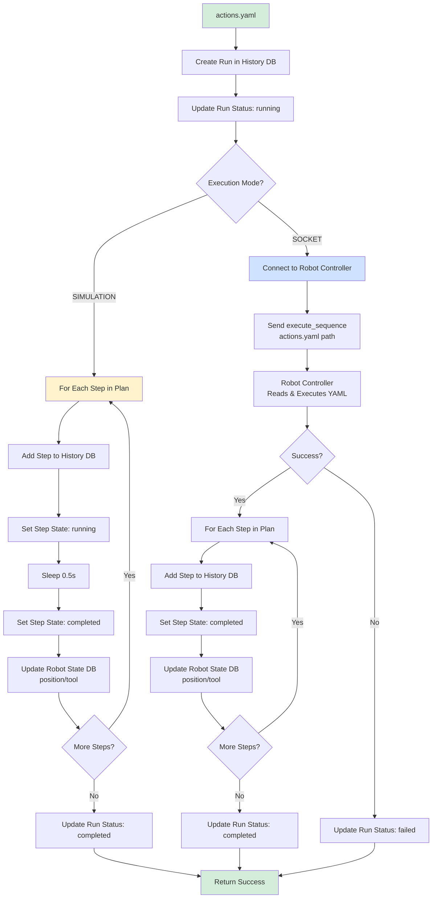
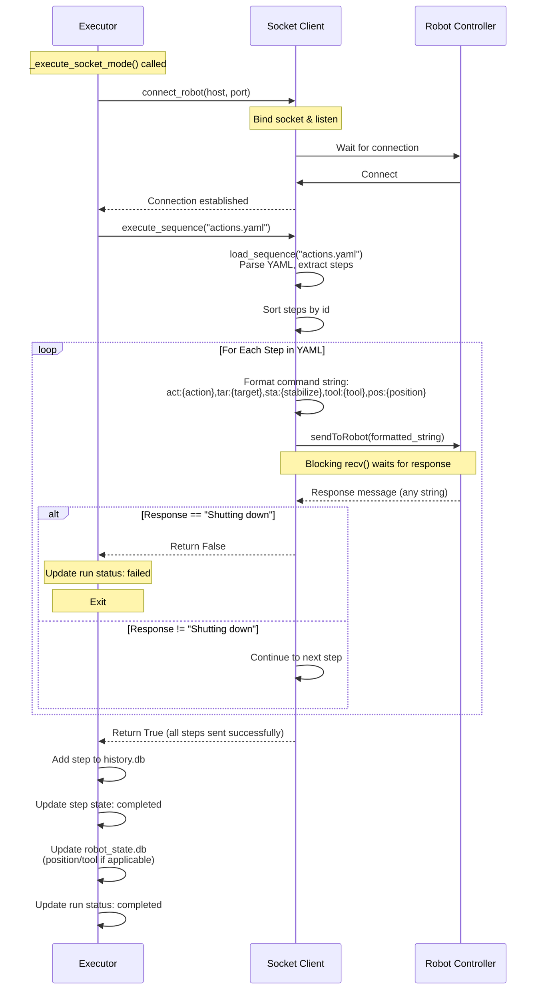

# Robot Layer - Robot Controller Communication

> **Note:** Code blocks in this document are **pseudocode and simplified code snippets** for clarity and readability. For actual implementation, see the referenced source files in `src/`.

## Overview

The Robot Layer executes validated YAML sequences step-by-step and maintains the system's execution audit trail. This layer reads `actions.yaml` (generated by the Verification Layer), communicates with the robot controller, and updates SQLite databases with real-time state changes. Execution supports two modes: **simulation** (for testing) and **socket** (for robot controller communication via TCP/IP).

**Key Responsibilities:**
- Read YAML sequence from `actions.yaml`
- Execute steps sequentially (moves and routines)
- Communicate with robot controller (socket mode) or simulate (simulation mode)
- Update robot state database (position, tool)
- Log execution history (runs, steps, completion/failure status)
- Track execution timing and errors

**Input:** YAML sequence (from `actions.yaml`)  
**Output:** Updated SQLite databases (robot_state.db, history.db)

---

## Execution Architecture



---

## Execution Modes

### Simulation Mode

**Purpose:** Internal testing without robot hardware.

**Configuration:**
```bash
# .env file
ROBOT_EXECUTION_MODE=simulation
```

**Behavior:**
1. Read plan from `actions.yaml`
2. For each step:
   - Log step start
   - Sleep for 0.5 seconds (simulate execution time)
   - Update SQLite databases (position, tool, step state)
   - Log step completion
3. Mark run as completed
4. Return success message

*See `src/core/robot/executor.py` (_execute_simulation_mode) for implementation*

**Use Cases:**
- Development and testing
- Showcasing without robot (robot studio or real robot)
- Operator training simulations
- Workflow debugging

---

### Socket Mode

**Purpose:** Production execution via TCP/IP communication with robot controller.

**Configuration:**
```bash
# .env file
ROBOT_EXECUTION_MODE=socket
ROBOT_SOCKET_HOST=127.0.0.1  # Robot controller IP
ROBOT_SOCKET_PORT=5000       # Robot controller port
```

**Behavior:**
1. Connect to robot controller via TCP/IP socket
2. Load and parse `actions.yaml` file into individual steps
3. For each step, send formatted command string to robot:
   - Format: `act:{action},tar:{target},sta:{stabilize},tool:{tool},pos:{position}`
   - Wait for acknowledgment from robot controller after each step
   - Send next step only after receiving ACK
4. Update SQLite databases after each step completion
5. Mark run as completed after all steps processed
6. Return success message

**Protocol Details:**
- **Line-by-line streaming**: Each step sent as individual formatted string
- **Synchronous execution**: Wait for robot ACK before sending next step
- **Message format**: Comma-separated key:value pairs
- **NOT a file transfer**: YAML parsed locally, commands streamed step-by-step

*See `src/core/robot/executor.py` (_execute_socket_mode) and `src/core/robot/socket_client_class.py` (execute_sequence) for implementation*

**Socket Communication Flow:**



**Example Message Exchange:**
```
Step 1: Executor → Robot
  "act:move,tar:Home,sta:,tool:,pos:"
  Robot → Executor: ACK

Step 2: Executor → Robot
  "act:move,tar:Tool_Weld_Position,sta:,tool:,pos:"
  Robot → Executor: ACK

Step 3: Executor → Robot
  "act:routine,tar:tool_attach,sta:1.5,tool:Welder,pos:Tool_Weld_Position"
  Robot → Executor: ACK
```

**Use Cases:**
- Production robot control
- Real hardware execution
- External robot controller integration

**Known Limitation:**
The current socket mode implementation updates databases in batch AFTER all commands are sent to the robot controller, rather than updating after each step execution. This creates a risk: if the robot fails mid-execution or the connection drops during the command loop, the databases (robot_state.db and history.db) will not reflect the actual robot state. The databases will either show no execution (if failure happens early) or incorrect state (if some steps executed but not all).

**Impact:**
- State mismatch between actual robot position/tool and database records
- Incomplete audit trail if connection fails mid-sequence
- No ability to resume from failure point since system doesn't know what actually executed

**Better Design (Not Implemented):**
Ideally, the robot controller should acknowledge each step AFTER execution completes, allowing the executor to update databases incrementally:
```
For each step:
  1. Send command to robot
  2. Wait for robot to execute
  3. Receive confirmation with actual result
  4. Update databases immediately
  5. Proceed to next step
```
This would provide real-time state synchronization and partial execution tracking, but requires changes to both the socket protocol and robot controller implementation.

---

## Database Updates

### Robot State Database (robot_state.db)

**Purpose:** Track current robot configuration (position, tool).

**Updates During Execution:**

| Step Type | Database Update | Code Reference |
|-----------|----------------|----------------|
| `move` | `update_position(target)` | After step completion |
| `tool_attach` | `update_tool(tool_name)` | After routine completion |
| `tool_release` | `update_tool("none")` | After routine completion |
| Other routines | No state update | Position/tool unchanged |

*See `src/core/robot/executor.py` (_update_state_from_step) for implementation*

**State Transitions Example:**

```
Initial State: {position: "Home", tool: "none"}

Step 1 (move to Tool_Weld_Position):
  → update_position("Tool_Weld_Position")
  → State: {position: "Tool_Weld_Position", tool: "none"}

Step 2 (tool_attach Welder):
  → update_tool("Welder")
  → State: {position: "Tool_Weld_Position", tool: "Welder"}

Step 3 (move to Pos_1):
  → update_position("Pos_1")
  → State: {position: "Pos_1", tool: "Welder"}

Step 4 (tackweld routine):
  → No state update (position and tool unchanged)
  → State: {position: "Pos_1", tool: "Welder"}

Step 5 (tool_release):
  → update_tool("none")
  → State: {position: "Pos_1", tool: "none"}
```

---

### History Database (history.db)

**Purpose:** Audit trail of all executions (runs and steps).

**Updates During Execution:**

| Execution Phase | Database Update |
|-----------------|----------------|
| Start | Create run record with operator input and plan |
| Start | Update run status to "running" |
| Before Step | Add step record (position, action) |
| Step Start | Update step state to "running" (simulation mode only) |
| Step Complete | Update step state to "completed" |
| Step Error | Update step state to "error" with error message |
| End (success) | Update run status to "completed" |
| End (failure) | Update run status to "failed" |

*See `src/core/knowledge/sqlite_client.py` (HistoryDB class) for schema and implementation details*

---
## Example Execution Traces

### Example 1: Simple Move Sequence (Simulation)

**YAML Input:**
```yaml
name: "Robot Sequence"
description: "Generated from verified plan"
steps:
  - action: "move"
    target: "Home"
  - action: "move"
    target: "Pos_1"
  - action: "move"
    target: "Pos_2"
```

**Execution Log (simplified):**
```json
{"ts": "...", "level": "INFO", "message": "Starting SIMULATION execution", "correlation_id": "abc-123"}
{"ts": "...", "level": "INFO", "message": "SIMULATION move", "correlation_id": "abc-123", "target": "Home"}
{"ts": "...", "level": "INFO", "message": "SIMULATION move", "correlation_id": "abc-123", "target": "Pos_1"}
{"ts": "...", "level": "INFO", "message": "SIMULATION move", "correlation_id": "abc-123", "target": "Pos_2"}
{"ts": "...", "level": "INFO", "message": "SIMULATION completed", "correlation_id": "abc-123", "steps": 3}
```

**Database State After Execution:**

robot_state.db:
```json
{
  "position": "Pos_2",
  "tool": "none"
}
```

history.db (runs):
```json
{
  "id": "abc-123",
  "operator_input": "Move to position 1 then position 2",
  "plan": "[{\"action\": \"move\", \"target\": \"Home\"}, ...]",
  "status": "completed",
  "created_at": "2025-01-19T10:00:00",
  "updated_at": "2025-01-19T10:00:02"
}
```

history.db (steps):
```json
[
  {"id": 1, "run_id": "abc-123", "position": "Home", "action": "move", "state": "completed"},
  {"id": 2, "run_id": "abc-123", "position": "Pos_1", "action": "move", "state": "completed"},
  {"id": 3, "run_id": "abc-123", "position": "Pos_2", "action": "move", "state": "completed"}
]
```

---

### Example 2: Tool Change with Routine (Simulation)

**YAML Input:**
```yaml
name: "Robot Sequence"
description: "Generated from verified plan"
steps:
  - action: "move"
    target: "Tool_Weld_Position"
  - action: "routine"
    target: "tool_attach"
    position: "Tool_Weld_Position"
    tool: "Welder"
  - action: "move"
    target: "Pos_1"
  - action: "routine"
    target: "tackweld"
    position: "Pos_1"
  - action: "routine"
    target: "tool_release"
    position: "Pos_1"
```

**Execution Log (simplified):**
```json
{"ts": "...", "level": "INFO", "message": "Starting SIMULATION execution", "correlation_id": "def-456"}
{"ts": "...", "level": "INFO", "message": "SIMULATION move", "target": "Tool_Weld_Position"}
{"ts": "...", "level": "INFO", "message": "SIMULATION tool attach", "tool": "Welder"}
{"ts": "...", "level": "INFO", "message": "SIMULATION move", "target": "Pos_1"}
{"ts": "...", "level": "INFO", "message": "SIMULATION routine", "routine": "tackweld"}
{"ts": "...", "level": "INFO", "message": "SIMULATION tool release"}
{"ts": "...", "level": "INFO", "message": "SIMULATION completed", "steps": 5}
```

**State Transitions:**

| Step | Action | Position After | Tool After |
|------|--------|----------------|------------|
| Initial | - | Home | none |
| 1 | move → Tool_Weld_Position | Tool_Weld_Position | none |
| 2 | tool_attach Welder | Tool_Weld_Position | Welder |
| 3 | move → Pos_1 | Pos_1 | Welder |
| 4 | tackweld routine | Pos_1 | Welder |
| 5 | tool_release | Pos_1 | none |

---

## Error Handling

### Step Execution Error (Simulation)

**Scenario:** Step fails during simulation (e.g., invalid step format).

**Result:** Step marked as "error" in history database, run status set to "failed", exception raised.

*See `src/core/robot/executor.py` for error handling implementation*

---

### Socket Connection Error

**Scenario:** Robot controller unreachable.

**Result:** Run status set to "failed", error response returned with connection error details.

*See `src/core/robot/executor.py` (_execute_socket_mode) for socket error handling*

---

## Integration with Workflow

### Upstream: Verification Layer

Robot Node receives:
- `yaml_sequence`: YAML string (already written to `actions.yaml` by Verify Node)
- `plan`: JSON list of steps (for database logging)
- `correlation_id`: Unique request ID
- `operator_input`: Original natural language command

### Downstream: Workflow Completion

Robot Node returns:
- `execution_result`: Success/failure status
- `response`: Human-readable message for operator

*See `src/core/translation/nodes/robot.py` for workflow integration*

---

## Key Design Decisions

### 1. YAML Read from File (Not State)

The executor reads `actions.yaml` from disk, not from workflow state.

---

### 2. SQLite Updates Only (No Neo4j)

Robot Executor never queries or updates Neo4j.

**Rationale:** Neo4j stores robot capabilities (static knowledge). SQLite stores robot state (dynamic runtime data). Executor operates on pre-validated plans, so no graph queries needed.

---

### 3. Dual-Mode Execution (Simulation + Socket)

Single codebase supports both simulation and robot controller communication.

**Rationale:** Enables development/testing without hardware. Production mode activated via environment variable, no code changes required.

---

### 4. Step-by-Step State Updates

State database updated after each step, not at end of sequence (one at the time).

**Rationale:** Real-time state tracking enables future implementations of mid-sequence queries (e.g., "Where is the robot?"). Also supports resume-from-failure scenarios (future enhancement).

---

## Summary

The Robot Layer is the **final action node** in the workflow. It reads the YAML sequence generated by the Verification Layer, executes steps sequentially (via simulation or socket communication), and maintains a complete audit trail in SQLite databases. The layer supports two modes: simulation (for testing) and socket (for robot controller communication). All state changes (position, tool) and execution history (runs, steps, completion status) are logged for traceability and debugging.
