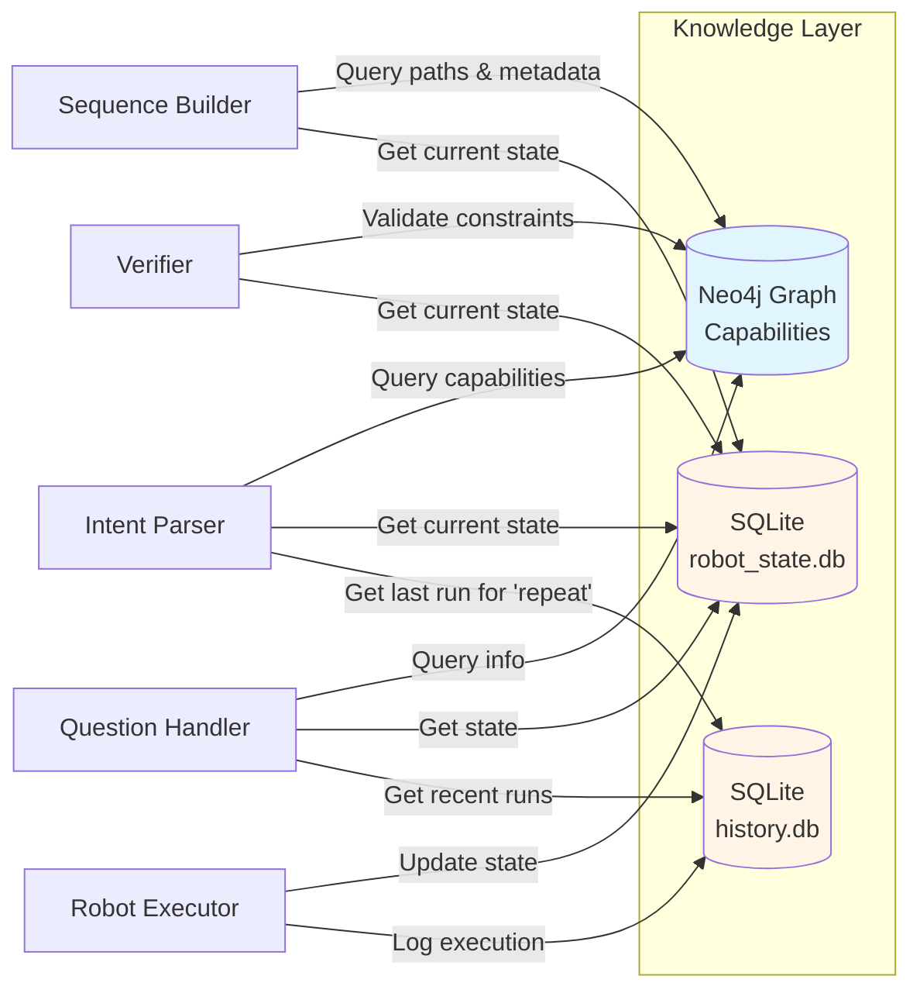
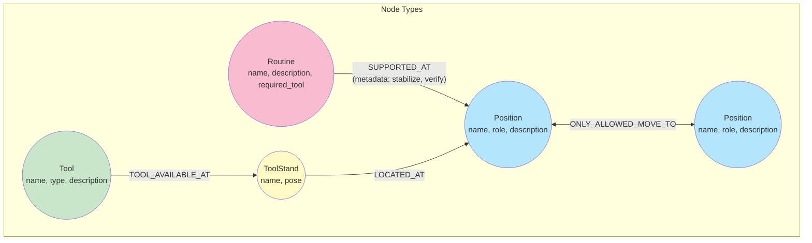
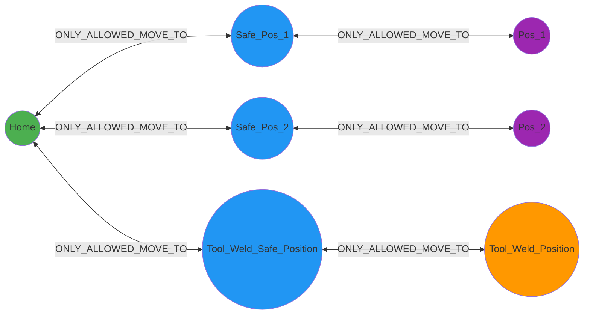
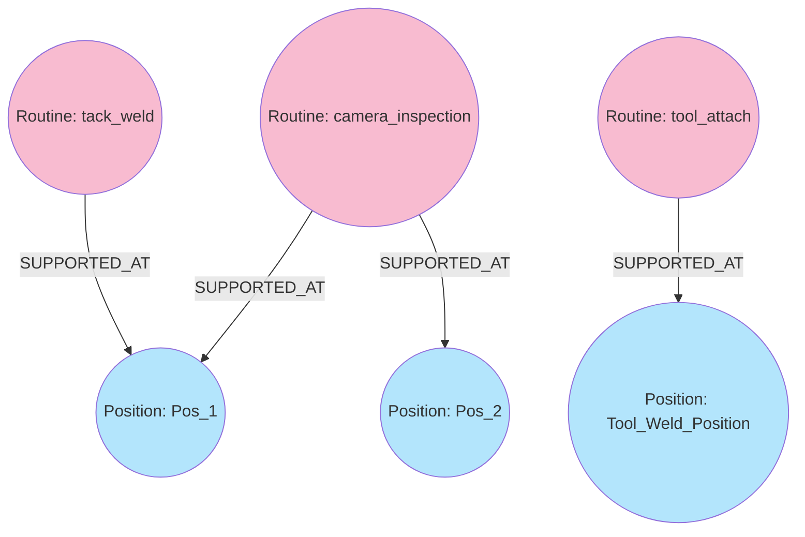
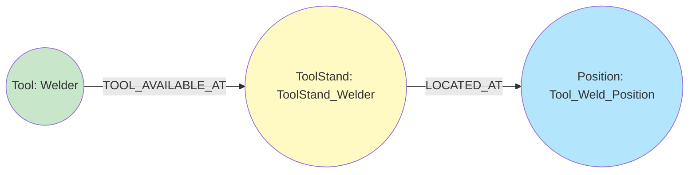

# Knowledge Layer - Data Storage and Retrieval

> **Note:** Code blocks in this document are **pseudocode and simplified code snippets** for clarity and readability. For actual implementation, see the referenced source files in `src/`.
---

## Overview

The Knowledge Layer provides two complementary data stores:

1. **Neo4j Graph Database** - Robot capabilities and constraints (WHAT is possible)
2. **SQLite Databases** - Runtime state and execution history (WHAT has happened)



---

## Neo4j Graph Database

### Purpose

Neo4j serves as the **single source of truth** for:
- Available positions (locations robot can reach)
- Allowed motion paths (safety whitelist)
- Available tools and storage locations
- Supported routines with position-specific metadata

### Node Types



#### 1. Position Node

**Properties:**
- `name` (string) - Unique identifier (e.g., "Home", "Safe_Pos_1", "Pos_1")
- `role` (string) - Functional category:
  - `home` - Starting/ending position
  - `safe_approach` - Intermediate safe waypoint
  - `tool_mount` - Tool storage location
  - `work` - Task execution location
- `description` (string) - Human-readable explanation

**Example:**
```cypher
(p:Position {
    name: "Home",
    role: "home",
    description: "Robot home position - safe starting point"
})
```

#### 2. Tool Node

**Properties:**
- `name` (string) - Tool identifier (e.g., "Welder", "Camera")
- `type` (string) - Tool category (e.g., "end_effector", "sensor")
- `description` (string) - Tool purpose

**Example:**
```cypher
(t:Tool {
    name: "Welder",
    type: "end_effector",
    description: "TIG welding head"
})
```

#### 3. ToolStand Node

**Properties:**
- `name` (string) - Stand identifier (e.g., "ToolStand_Welder")
- `pose` (string) - Stand description (e.g., "Welder stand")

**Example:**
```cypher
(ts:ToolStand {
    name: "ToolStand_Welder",
    pose: "Welder stand"
})
```

#### 4. Routine Node

**Properties:**
- `name` (string) - Routine identifier (e.g., "tack_weld", "camera_inspection")
- `description` (string) - Routine purpose
- `required_tool` (string) - Tool dependency or "none"

**Categories:**
- **System Routines**: `tool_attach`, `tool_release`
- **Task Routines**: Application-specific actions (e.g., welding, inspection)

**Example:**
```cypher
(r:Routine {
    name: "tack_weld",
    description: "Perform tack weld at position",
    required_tool: "Welder"
})
```

---

### Relationship Types

#### 1. :ONLY_ALLOWED_MOVE_TO

**Purpose:** Defines allowed motion paths between positions (safety whitelist)

**Direction:** Bidirectional (enforced by graph structure)

**Properties:** None

**Example:**
```cypher
(p1:Position {name: "Home"})
-[:ONLY_ALLOWED_MOVE_TO]->
(p2:Position {name: "Safe_Pos_1"})

(p2)-[:ONLY_ALLOWED_MOVE_TO]->(p1)  // Reverse edge required
```

**Graph Structure Example:**


**Usage:**
- Sequence Builder uses pathfinding to generate navigation steps
- Verifier checks all moves exist as edges in graph
- Prevents invalid/unsafe robot motions

---

#### 2. :SUPPORTED_AT

**Purpose:** Links routines to positions where they can be executed WITH metadata

**Direction:** Routine → Position

**Properties (Metadata):**
- `stabilize` (float, optional) - Wait time in seconds before routine execution
- `action_after` (string, optional) - Post-routine action (e.g., "move_safe")
- `verify` (string, optional) - Verification routine name to run after execution

**Example:**
```cypher
(r:Routine {name: "tack_weld"})
-[:SUPPORTED_AT {
    stabilize: 1.5,
    action_after: "move_safe",
    verify: "weld_check"
}]->
(p:Position {name: "Pos_1"})
```

**:SUPPORTED_AT Visualization:**


**Usage:**
- Sequence Builder queries and adds metadata for each routine step
- Different positions can have different metadata for same routine

**Query Example:**
```cypher
MATCH (r:Routine {name: "tack_weld"})
      -[rel:SUPPORTED_AT]->
      (p:Position {name: "Pos_1"})
RETURN rel.stabilize, rel.action_after, rel.verify
```

**Returns:**
```json
{
    "stabilize": 1.5,
    "action_after": "move_safe",
    "verify": "weld_check"
}
```

---

#### 3. :LOCATED_AT

**Purpose:** Maps tool stands to physical positions

**Direction:** ToolStand → Position

**Properties:** None

**Example:**
```cypher
(ts:ToolStand {name: "ToolStand_Welder"})
-[:LOCATED_AT]->
(p:Position {name: "Tool_Weld_Position", role: "tool_mount"})
```

---

#### 4. :TOOL_AVAILABLE_AT

**Purpose:** Maps tools to their storage stands

**Direction:** Tool → ToolStand

**Properties:** None

**Example:**
```cypher
(t:Tool {name: "Welder"})
-[:TOOL_AVAILABLE_AT]->
(ts:ToolStand {name: "ToolStand_Welder"})
```

**Complete Tool Location Path:**


**Query for Tool Location:**
```cypher
MATCH (tool:Tool {name: "Welder"})
      -[:TOOL_AVAILABLE_AT]->
      (stand:ToolStand)
      -[:LOCATED_AT]->
      (pos:Position)
RETURN pos.name AS position
```

**Returns:** `"Tool_Weld_Position"`


---

## Neo4j Query Functions

### Client: `src/core/knowledge/neo4j_client.py`

The Neo4j client provides 10 query functions for robot capabilities and constraints. This section organizes them by **component usage** to show how they work together in real workflows.

---

### Available Functions (Quick Reference)

| Function | Purpose | Returns |
|----------|---------|---------|
| `get_all_positions()` | All positions in graph | List of position dicts |
| `get_all_tools()` | All available tools | List of tool dicts |
| `get_all_routines()` | All routines | List of routine dicts |
| `get_tool_locations()` | Tool→Position mapping | Dict[tool_name, position_name] |
| `get_allowed_moves(pos)` | Direct neighbors from position | List of position names |
| `get_supported_positions(routine)` | Positions supporting routine | List of position names |
| `get_routine_by_name(routine)` | Routine details | Routine dict or None |
| `get_routine_metadata(routine, pos)` | Position-specific metadata | Metadata dict or None |
| `get_shortest_path(from, to)` | Navigation path between positions | List of position names |
| `is_move_allowed(from, to)` | Check if edge exists | Boolean |

---

### Usage by Component

#### Router

**Purpose:** Classify operator input (action/question/unknown)

**Neo4j Queries:**
- `get_all_positions()` - Provide position context to LLM for routing decision
- `get_all_tools()` - Provide tool context to LLM
- `get_all_routines()` - Provide routine context to LLM

**Usage Pattern:**
Router queries all capabilities to build comprehensive context for the LLM routing decision. This helps distinguish between action commands ("weld at position 1") and information queries ("what positions exist?").

**Cypher Queries Used:**
```cypher
MATCH (p:Position) RETURN p.name, p.role, p.description ORDER BY p.name
MATCH (t:Tool) RETURN t.name, t.description ORDER BY t.name
MATCH (r:Routine) RETURN r.name, r.description, COALESCE(r.required_tool, 'none') ORDER BY r.name
```

---

#### Intent Parser

**Purpose:** Extract high-level intent from natural language using LLM

**Neo4j Queries:**
- `get_all_positions()` - Provide position context to LLM for intent extraction
- `get_all_tools()` - Provide tool context to LLM
- `get_all_routines()` - Provide routine context to LLM

**SQLite Queries:**
- `RobotStateDB.get_state()` - Include current position/tool in LLM context
- `HistoryDB.get_runs_by_date()` - Support "repeat last task" commands

**Usage Pattern:**
Intent Parser builds comprehensive context for the LLM to understand operator commands. Queries current robot state and recent history to support contextual commands like "repeat that" or "go back to previous position".


---

#### Sequence Builder

**Purpose:** Convert high-level intent into detailed, executable plan using graph algorithms

**Neo4j Queries (CRITICAL):**
- `get_shortest_path(from, to)` - Generate navigation steps for every position change
- `get_routine_metadata(routine, position)` - Add metadata to every routine step
- `get_tool_locations()` - Determine where to navigate for tool changes
- `get_routine_by_name(routine)` - Check tool requirements before planning
- `get_supported_positions(routine)` - Validate routine can run at target position

**SQLite Queries:**
- `RobotStateDB.get_state()` - Get starting position and tool for planning

**Usage Pattern:**
Sequence Builder is the heaviest user of Neo4j. For every task, it:
1. Queries current state to start planning
2. Uses `get_shortest_path()` to generate navigation between positions
3. Uses `get_routine_metadata()` to enrich every routine step with stabilization times and verification checks
4. Queries tool locations when tool changes are needed

---

#### Verifier

**Purpose:** Safety validation against graph constraints

**Neo4j Queries:**
- `get_all_positions()` - Validate all position names exist in graph
- `is_move_allowed(from, to)` - **Validate every move command has graph edge**
- `get_routine_metadata(routine, position)` - Validate routine supported at position
- `get_all_routines()` - Check routine tool requirements
- `get_tool_locations()` - Detect tool stand collisions

**SQLite Queries:**
- `RobotStateDB.get_state()` - Get initial position/tool for state simulation

**Usage Pattern:**
Verifier simulates plan execution and checks every step against graph constraints. Uses `is_move_allowed()` to ensure no invalid motions, and `get_routine_metadata()` to confirm routines are supported at target positions.

---

#### Question Handler

**Purpose:** Answer information queries without executing commands

**Neo4j Queries:**
- `get_all_positions()` - Answer "what positions exist?"
- `get_all_tools()` - Answer "what tools are available?"
- `get_all_routines()` - Answer "what routines exist?"
- `get_allowed_moves(position)` - Answer "where can I go from here?"

**SQLite Queries:**
- `RobotStateDB.get_state()` - Answer "where is the robot?"
- `HistoryDB.get_runs_by_date(date)` - Answer "what did the robot do today/yesterday?"

**Usage Pattern:**
Question Handler provides read-only access to robot capabilities and status. Uses broad queries (`get_all_*`) for capability questions and `get_allowed_moves()` for motion-specific questions. The LLM processes all capabilities context to generate natural language answers.

---

## SQLite Databases

### 1. robot_state.db - Current State Tracking

**Purpose:** Single-row table tracking current robot position and tool

**Schema:**
```sql
CREATE TABLE robot_state (
    id INTEGER PRIMARY KEY CHECK (id = 1),  -- Always 1 (single row)
    current_position TEXT NOT NULL,
    current_tool TEXT NOT NULL,
    last_updated TEXT NOT NULL  -- ISO8601 timestamp
);
```

**Default State:**
```sql
INSERT INTO robot_state (id, current_position, current_tool, last_updated)
VALUES (1, 'Home', 'none', '2025-01-15T12:34:56');
```

**Client:** `src/core/knowledge/sqlite_client.py` → `RobotStateDB`

**Operations:**

#### `get_state() -> Dict`
```python
{
    "current_position": "Home",
    "current_tool": "none",
    "last_updated": "2025-01-15T12:34:56"
}
```

**Used By:**
- Intent Parser (include current position/tool in LLM context)
- Sequence Builder (determine starting position/tool for planning)
- Verifier (initial position/tool for state simulation)
- Robot Executor (get_current_state method)
- Question Handler (answer "where is the robot?")

#### `update_position(position: str)`
**Used By:** Robot Executor (after each move command)

#### `update_tool(tool: str)`
**Used By:** Robot Executor (after tool_attach/tool_release)

---

### 2. history.db - Execution Audit Trail

**Purpose:** Log all task executions for replay and analysis

**Schema:**

#### Table: `runs`
```sql
CREATE TABLE runs (
    run_id TEXT PRIMARY KEY,              -- UUIDv4 correlation_id
    operator_input TEXT NOT NULL,         -- Original command
    sequence_json TEXT NOT NULL,          -- Validated JSON plan
    status TEXT NOT NULL CHECK (status IN ('pending', 'running', 'completed', 'failed')),
    started_at TEXT NOT NULL,             -- ISO8601
    finished_at TEXT                      -- ISO8601 (NULL if running)
);
```

#### Table: `run_steps`
```sql
CREATE TABLE run_steps (
    step_id INTEGER PRIMARY KEY AUTOINCREMENT,
    run_id TEXT NOT NULL,                 -- Foreign key to runs
    position TEXT NOT NULL,
    action TEXT NOT NULL CHECK (action IN ('move', 'routine')),
    state TEXT NOT NULL CHECK (state IN ('pending', 'running', 'completed', 'error')),
    error TEXT,                           -- Error message if failed
    started_at TEXT NOT NULL,             -- ISO8601
    finished_at TEXT,                     -- ISO8601 (NULL if running)
    FOREIGN KEY (run_id) REFERENCES runs (run_id)
);
```

**Client:** `src/core/knowledge/sqlite_client.py` → `HistoryDB`

**Operations:**

#### `create_run(run_id, operator_input, sequence_json)`
**Used By:** Robot Executor (start of execution)

#### `update_run_status(run_id, status)`
**Used By:** Robot Executor (on completion/failure)

#### `add_step(run_id, position, action) -> step_id`
**Used By:** Robot Executor (before each step)

#### `update_step_state(step_id, state, error)`
**Used By:** Robot Executor (after each step)

#### `get_runs_by_date(date) -> List[Dict]`
**Returns:** List of runs from specific date (YYYY-MM-DD format)
**Used By:** Intent Parser (for "repeat" commands), Question Handler (recent history)

#### `get_failed_positions(run_id) -> List[str]`
**Returns:** List of position names where steps failed during a run
**Used By:** Debugging and error analysis

---

## Key Design Principles

### 1. Single Source of Truth
- Neo4j defines WHAT is possible (capabilities)
- SQLite tracks WHAT has happened (state/history)
- No redundant data between systems

### 2. Metadata Co-location
- Routine metadata stored ON relationships (:SUPPORTED_AT)
- Different positions can have different stabilize times for same routine
- Graph structure naturally represents position-specific behavior

### 3. Stateless Planning
- Sequence Builder queries current state but doesn't lock it
- Every command is independent (no target_position reservation)
- Robot state updated AFTER execution, not before

### 4. Path-Based Navigation
- Graph edges define allowed moves (safety whitelist)
- `get_shortest_path()` generates navigation automatically
- Impossible to plan invalid motion (no path = error)

### 5. Audit Trail Separation
- History DB for compliance/debugging
- Never queried during normal execution flow
- Can be cleared without affecting system operation

---

## Summary

**Neo4j Graph Database:**
- 4 node types: Position, Tool, ToolStand, Routine
- 4 relationship types: ONLY_ALLOWED_MOVE_TO, SUPPORTED_AT, LOCATED_AT, TOOL_AVAILABLE_AT
- Metadata stored on :SUPPORTED_AT relationships
- 10 query functions for capabilities, paths, metadata:
  1. `get_all_positions()` - All positions
  2. `get_all_tools()` - All tools
  3. `get_all_routines()` - All routines
  4. `get_tool_locations()` - Tool → Position mapping
  5. `get_allowed_moves()` - Direct neighbors from position
  6. `get_supported_positions()` - Positions supporting routine
  7. `get_routine_by_name()` - Routine details
  8. `get_routine_metadata()` - Position-specific routine metadata
  9. `get_shortest_path()` - Pathfinding between positions
  10. `is_move_allowed()` - Edge validation
- Used by: Router (context), Intent Parser (context), Sequence Builder (planning), Verifier (validation), Question Handler (information)

**SQLite Databases:**
- `robot_state.db`: Single-row current state (position, tool)
- `history.db`: Execution audit trail (runs + steps tables)
- Used by: Intent Parser (read history), Sequence Builder (read state), Verifier (read state), Question Handler (read state/history), Robot Executor (write state/history)

